# Bayesian Analysis of Macroevolutionary Mixtures

**Author**: Léo-Paul Dagallier  
**Last update**: 2023-08-09

------------------------------------------------------------------------

## Linux installation

``` bash
cd <path to program directory>
git clone https://github.com/macroevolution/bamm.git
cd bamm
mkdir build
cd build
cmake ..
make -j
sudo make install
```

## BAMM analysis

### Input data

Prepare the path variables:

- in bash:

``` bash
path_to_data="data";
path_to_output="outputs";
cd $path_to_output
mkdir BAMM
```

- in R:

``` r
path_to_tree = c("data/name_MCC_monodoreae3_monod_pruned.newick")
path_to_output = c("outputs/BAMM/")
path_to_figures = c("figures/")
data_suffix <- "monodoreae3"
```

### Check the prerequesities of the tree

The tree needs to be ultrametric, fully bifurcating (no polytomy) and
minimum branch length should be \> 0.

``` r
library(ape)
v <- read.tree(path_to_tree)
is.ultrametric(v)
```

    ## [1] TRUE

``` r
is.binary(v)
```

    ## [1] TRUE

``` r
# Now to check min branch length:
min(v$edge.length)
```

    ## [1] 0.1063518

### Prepare the configuration file

Prepare manually the configuration file in the `data/BAMM` directory.

#### Prepare using BAMMtools

``` r
library(BAMMtools)
setBAMMpriors(v, outfile = paste0(path_to_output, "myPriors.txt"))
```

    ## 
    ## Prior block written to file << outputs/BAMM/myPriors.txt >>
    ## Copy and paste the contents of the file into the
    ## priors block of your BAMM input file
    ## 
    ## This function simply sets the expectedNumberOfShifts to 1;
    ## This is a parameter you may need to vary to achieve good convergence
    ## with your data.

Copy the values from myPriors.txt into the bamm_config_FINAL file.

### Run the analysis

In bash (not R).

``` bash
cd $path_to_output/BAMM
bamm -c $path_to_data/bamm_config_FINAL
```

### Assess MCMC convergence

Compute effective sample size after discarding the burnin:

``` r
mcmcout <- read.csv(paste0(path_to_output, "mcmc_out.txt"), header=T)
burnstart <- floor(0.1 * nrow(mcmcout))
postburn <- mcmcout[burnstart:nrow(mcmcout), ]
```

``` r
library(coda)
paste0("ESS for the log Likelihood: ", effectiveSize(postburn$logLik))
```

    ## [1] "ESS for the log Likelihood: 901.000000000001"

``` r
paste0("ESS for the log Prior: ",effectiveSize(postburn$logPrior))
```

    ## [1] "ESS for the log Prior: 901"

``` r
paste0("ESS for the number of shifts: ",effectiveSize(postburn$N_shifts))
```

    ## [1] "ESS for the number of shifts: 708.541052069349"

Visual assessment of MCMC convergence of the BAMM run:

``` r
par(mfrow=c(2,2))
plot(mcmcout$logLik, type="l", main="a)", xlab="Generations",ylab="log Likelihood")
plot(mcmcout$N_shifts ~ mcmcout$generation, main="b)", xlab="Generations",ylab="Number of shifts")
plot(postburn$logLik, type="l", main="c)", xlab="Generations",ylab="log Likelihood")
plot(postburn$N_shifts ~ postburn$generation, main="d)", xlab="Generations",ylab="Number of shifts")
```

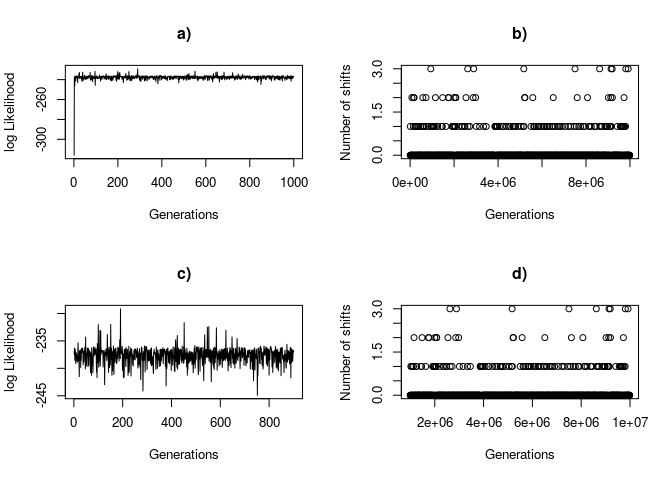<!-- -->

Save the plot in PDF:

``` r
pdf(paste0(path_to_figures, "BAMM - 1. Assessing MCMC convergence of the BAMM run - ", data_suffix, ".pdf"))
par(mfrow=c(2,2))
plot(mcmcout$logLik, type="l", main="a)", xlab="Generations",ylab="log Likelihood")
plot(mcmcout$N_shifts ~ mcmcout$generation, main="b)", xlab="Generations",ylab="Number of shifts")
plot(postburn$logLik, type="l", main="c)", xlab="Generations",ylab="log Likelihood")
plot(postburn$N_shifts ~ postburn$generation, main="d)", xlab="Generations",ylab="Number of shifts")
dev.off()
```

    ## png 
    ##   2

### Getting BAMM results

``` r
library(BAMMtools)
tree <- read.tree(path_to_tree)
edata <- getEventData(tree, eventdata = paste0(path_to_output, "event_data.txt"), burnin=0.1)
```

    ## Reading event datafile:  outputs/BAMM/event_data.txt 
    ##      ...........
    ## Read a total of 200 samples from posterior
    ## 
    ## Discarded as burnin: GENERATIONS <  950000
    ## Analyzing  181  samples from posterior
    ## 
    ## Setting recursive sequence on tree...
    ## 
    ## Done with recursive sequence

## Analysis of rate shifts

### How many rate shifts

Compute the posterior probabilities of the models sampled using BAMM:

``` r
post_probs <- table(postburn$N_shifts) / nrow(postburn)
post_probs
```

    ## 
    ##           0           1           2           3 
    ## 0.847946726 0.119866815 0.022197558 0.009988901

``` r
shift_probs <- summary(edata)
```

    ## 
    ## Analyzed 181 posterior samples
    ## Shift posterior distribution:
    ## 
    ##          0     0.8400
    ##          1     0.1300
    ##          2     0.0220
    ##          3     0.0055
    ## 
    ## Compute credible set of shift configurations for more information:
    ##  See ?credibleShiftSet and ?getBestShiftConfiguration

Posterior probability of the expected number of rate shifts.

``` r
par(mfrow=c(1,1))
plot(post_probs, xlim=c(0,8), main="", ylab="Posterior", xlab="Number of shifts")
```

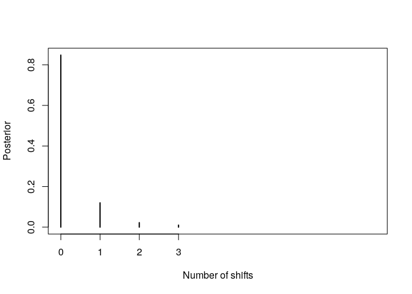<!-- -->

Save the plot in PDF:

``` r
pdf(paste0(path_to_figures, "BAMM - 2. Posterior for number of shifts - ", data_suffix, ".pdf"))
plot(post_probs, xlim=c(0,8), main="", ylab="Posterior", xlab="Number of shifts")
dev.off()
```

    ## png 
    ##   2

### Compute Bayes Factor

``` r
bfmat <- computeBayesFactors(mcmcout, expectedNumberOfShifts=1, burnin=0.1)
bfmat[,1]
```

    ##          0          1          2          3 
    ## 1.00000000 0.28272251 0.10471204 0.09424084

Here it means that the models with 1, 2 or 3 shifts are not better than
the null model (the model with 0 shift).

### Mean Phylo rate plot

Speciation rate through time:

``` r
# plot.bammdata(edata, tau=0.001, spex="s", legend=T, lwd=1.5, logcolor = F,  breaksmethod = "linear")
ratesHistogram(plot.bammdata(edata, tau=0.001, spex="s", legend=T, lwd=1.5), plotBrks = TRUE, xlab = "Speciation rate")
```

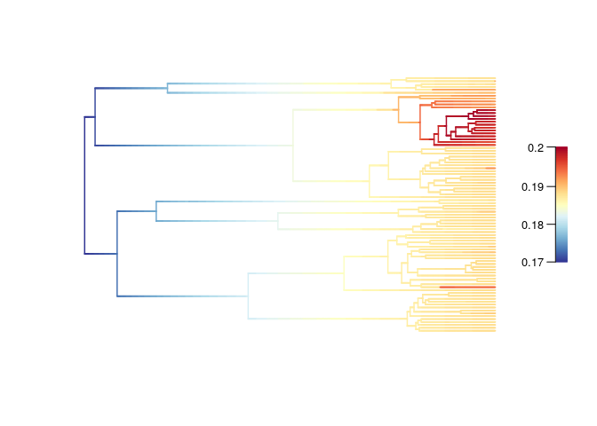<!-- -->

``` r
axis(side = 1, at = c(0, 0.17, 0.175, 0.180, 0.185, 0.190, 0.195, 0.20, 0.205, 0.21, 0.215, 0.3),  cex.axis = 0.75, tcl = NA, mgp = c(0,  0.25, 0))
```

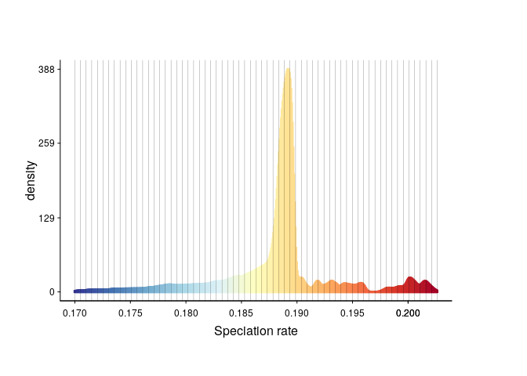<!-- -->

Extinction rate through time:

``` r
ratesHistogram(plot.bammdata(edata, tau=0.001, spex="e", legend=T, lwd=1.5), plotBrks = TRUE, xlab = "Extinction rate")
```

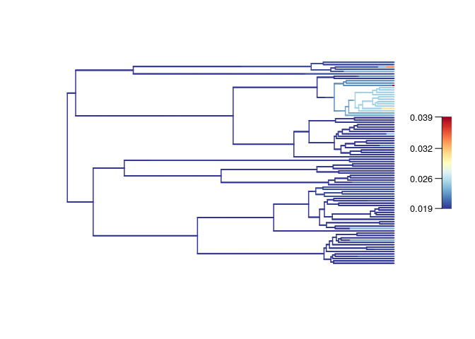<!-- -->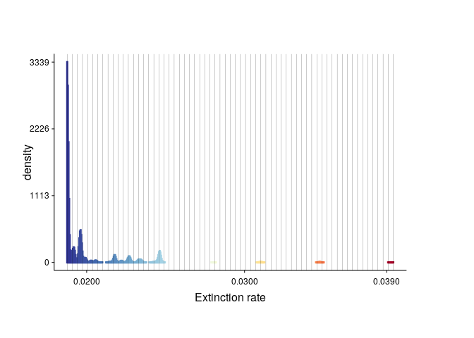<!-- -->

Net diversification rate through time:

``` r
ratesHistogram(plot.bammdata(edata, tau=0.001, spex="netdiv", legend=T, lwd=1.5), plotBrks = TRUE, xlab = "Net diversification rate")
```

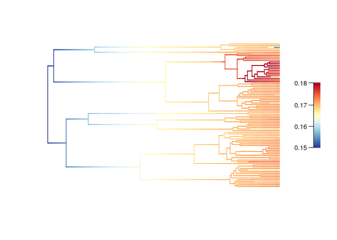<!-- -->

``` r
axis(side = 1, at = c(0, 0.15, 0.155, 0.16, 0.165, 0.17, 0.175, 0.180),  cex.axis = 0.75, tcl = NA, mgp = c(0,  0.25, 0))
```

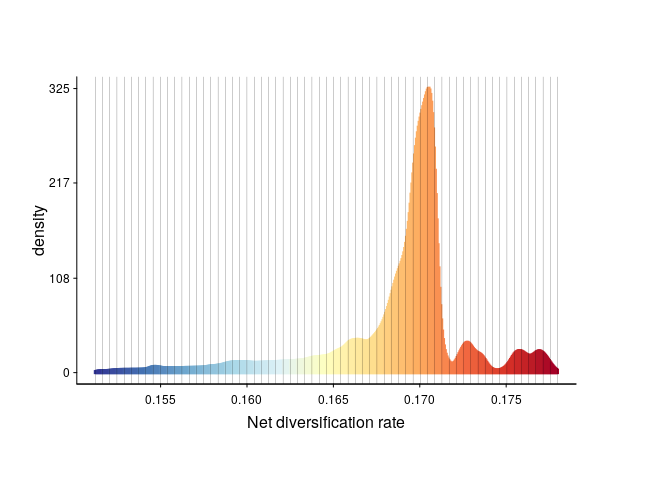<!-- -->

Save the plots in PDF:

``` r
pdf(paste0(path_to_figures, "BAMM - 3. Speciation rate through time of Monodoreae - ", data_suffix, ".pdf"))
plot.bammdata(edata, tau=0.001, spex="s", legend=T, lwd=2, labels = T, cex = 0.45)
dev.off()
```

    ## png 
    ##   2

``` r
pdf(paste0(path_to_figures, "BAMM - 4. Extinction rate through time of Monodoreae - ", data_suffix, ".pdf"))
plot.bammdata(edata, tau=0.001, spex="e", legend=T, lwd=2, labels = T, cex = 0.45)
dev.off()
```

    ## png 
    ##   2

``` r
pdf(paste0(path_to_figures, "BAMM - 5. Net diversification rate through time of Monodoreae - ", data_suffix, ".pdf"))
plot.bammdata(edata, tau=0.001, spex="netdiv", legend=T, lwd=2, labels = T, cex = 0.45)
dev.off()
```

    ## png 
    ##   2

### Bayesian credible sets of shift configurations

``` r
css <- credibleShiftSet(edata, expectedNumberOfShifts=1, threshold=5, set.limit = 0.95)
css$number.distinct
```

    ## [1] 1

``` r
summary(css)
```

    ## 
    ##  95 % credible set of rate shift configurations sampled with BAMM
    ## 
    ## Distinct shift configurations in credible set:  1
    ## 
    ## Frequency of 1 shift configurations with highest posterior probability:
    ## 
    ## 
    ##    rank     probability cumulative  Core_shifts
    ##          1  0.9834254  0.9834254          0

``` r
plot.credibleshiftset(css, spex="netdiv", BFcriterion=5, border=F, pal="temperature")
```

    ## Omitted 0 plots

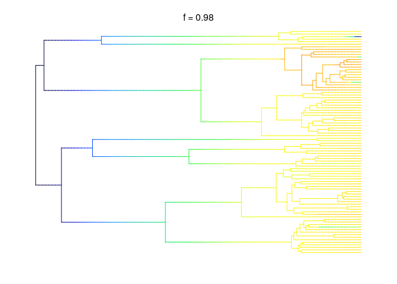<!-- -->

``` r
plot.credibleshiftset(css, spex="s", BFcriterion=5, border=F, pal="temperature")
```

    ## Omitted 0 plots

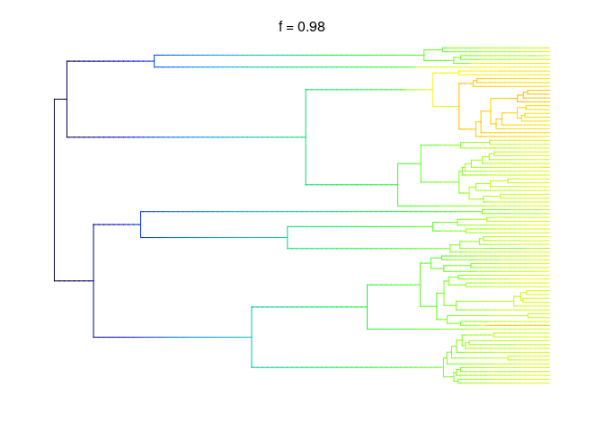<!-- -->

``` r
plot.credibleshiftset(css, spex="e", BFcriterion=5, border=F, pal="temperature")
```

    ## Omitted 0 plots

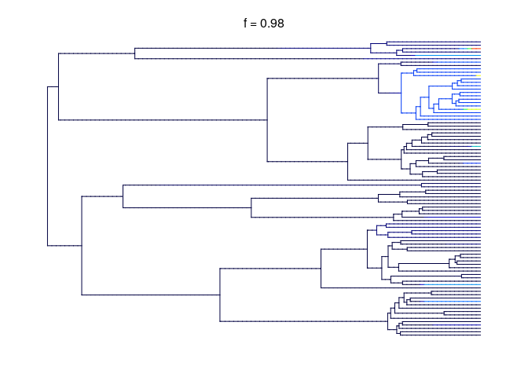<!-- -->

### Finding the single best shift configuration

``` r
best <- getBestShiftConfiguration(edata, expectedNumberOfShifts=1)
```

    ## Processing event data from data.frame
    ## 
    ## Discarded as burnin: GENERATIONS <  0
    ## Analyzing  1  samples from posterior
    ## 
    ## Setting recursive sequence on tree...
    ## 
    ## Done with recursive sequence

``` r
{plot.bammdata(best, lwd = 2)
addBAMMshifts(best, cex=2.5)}
```

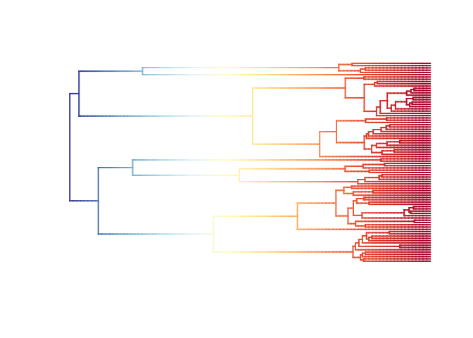<!-- -->
