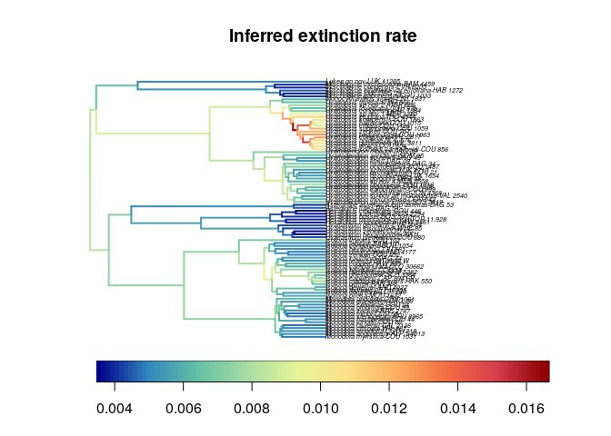

# ClaDS

**Author**: Léo-Paul Dagallier  
**Last update**: 2023-08-09

------------------------------------------------------------------------

We’ll make use of ClaDS from the PANDA package (Julia). See:
<https://hmorlon.github.io/PANDA.jl/stable/>.

## PANDA installation

``` bash
julia
using Pkg
Pkg.add("PANDA")
```

Note that PANDA uses R functions. So the packages `ape`, `coda`,
`RColorBrewer` and `fields` should be installed.

## Input data

Prepare the path variables:

- in bash:

``` bash
path_to_output="outputs/";
cd $path_to_output
mkdir ClaDS
cd ClaDS
```

- in Julia:

``` bash
julia
path_to_tree = "data/name_MCC_monodoreae3_monod_pruned.tre"
```

Be vigilent that a “.tre” file actually exists, otherwise duplicate and
rename the “.newick” to “.tre”.

- in R:

``` r
data_suffix = "monodoreae3"
path_to_tree = c("data/name_monodoreae3_monod_pruned.newick")
path_to_output = c("outputs/ClaDS/")
path_to_Rdata <- paste0(path_to_output, "ClaDS_output_", data_suffix, ".Rdata")
```

## ClaDS analysis

Here we run ClaDS with variable sampling fraction across the tree.

ClaDS needs the sampling fraction to be coded in a vector of length
*number of the tips in the phylogeny*, with a value of sampling fraction
(\[0,1\]) for each tip, with the values ordered as the order of the tips
in the phylogeny (i.e. as in the phylo object).  
We thus need to retrieve the sampling fraction for each species.

Retrieve the tip labels in the correct order and write it in the text
format.

``` r
path_to_tree = c("data/name_MCC_monodoreae3_monod_pruned.newick")
path_to_output = c("outputs/ClaDS/")
library(ape)
tree = read.tree(path_to_tree)
write.table(x=tree$tip.label, file = paste0(path_to_output, "TIPLABS_", gsub(path_to_tree, pattern = ".*/", replacement = "")), col.names = "tip_label")
```

Use the [table coding the sampling fraction in
BAMM](outputs/BAMM/bamm_sampling.txt) to code the sampling fraction for
ClaDS. Order the sampling fractions according to the order in the
phylogeny and layout it in order to be in the Julia vector element
format: \[0.1, 0.2, … 0.8, 0.1\].

Run ClaDS with different sampling fractions across the tree:

``` bash
julia
using PANDA
my_tree = load_tree(path_to_tree)
f = [1, 1, 1, 1, 1, 1, 1, 1, 1, 1, 1, 1, 1, 1, 1, 1, 1, 1, 1, 1, 1, 1, 1, 1, 1, 1, 1, 1, 1, 1, 1, 1, 1, 1, 1, 1, 1, 1, 1, 1, 1, 1, 1, 1, 1, 1, 1, 1, 1, 1, 1, 1, 1, 1, 1, 1, 1, 1, 1, 1, 1, 1, 1, 1, 0.84, 0.84, 0.84, 0.84, 0.84, 0.84, 0.84, 0.84, 0.84, 0.84, 0.84, 0.84, 0.84, 0.84, 0.84, 0.84, 1, 1, 1, 1, 1, 1, 1, 0.5]
output = infer_ClaDS(my_tree, print_state = 100, f = f)
using JLD2
@save "./output" output
save_ClaDS_in_R(output, "./ClaDS_output.Rdata")
```

Immediately rename the .Rdata file:

``` r
setwd(path_to_output)
file.rename(from = "ClaDS_output.Rdata", to = paste0("ClaDS_output_", data_suffix, ".Rdata"))
file.rename(from = "output", to = paste0("output_", data_suffix))
```

Plot the output:

``` bash
plot_CladsOutput(output)
```

Switch to R for downstream plots:

``` r
# library(RPANDA)
library(ape)
library(RColorBrewer)
library(fields)
source(file = "R/plot_ClaDS_phylo2.R")
```

### Speciation rate

``` r
load(path_to_Rdata)
plot_ClaDS_phylo2(CladsOutput$tree, CladsOutput$lambdai_map, main = "Inferred speciation rate", show.tip.label = T, cex = 0.45, log = F)
```

<!-- -->

Save the plot in PDF:

``` r
pdf(paste0(path_to_output, "ClaDS - Speciation rate through time of Monodoreae - ", data_suffix, ".pdf"))
plot_ClaDS_phylo2(CladsOutput$tree, CladsOutput$lambdai_map, main = "Inferred speciation rate", show.tip.label = T, cex = 0.45, log = F)
dev.off()
```

    ## png 
    ##   2

### Extinction rate

``` r
plot_ClaDS_phylo2(CladsOutput$tree, (CladsOutput$eps_map * CladsOutput$lambdai_map), main = "Inferred extinction rate", show.tip.label = T, cex = 0.45, log = F)
```

<!-- -->

Save the plot in PDF:

``` r
pdf(paste0(path_to_output, "ClaDS - Extinction rate through time of Monodoreae - ", data_suffix, ".pdf"))
plot_ClaDS_phylo2(CladsOutput$tree, (CladsOutput$eps_map * CladsOutput$lambdai_map), main = "Inferred extinction rate", show.tip.label = T, cex = 0.45, log = F)
dev.off()
```

    ## png 
    ##   2
