# CoMET

**Author**: Léo-Paul Dagallier  
**Last update**: 2023-08-09

------------------------------------------------------------------------

# CoMET analysis (sudden extinction) from TESS package

## Input data

Prepare the output folder:

``` bash
path_to_output="outputs/";
cd $path_to_output
mkdir CoMET
```

Prepare the path variables: - in R:

``` r
path_to_tree = c("data/name_MCC_monodoreae3_monod_pruned.newick")
path_to_output = c("outputs/CoMET/")
data_suffix <- "monodoreae3"
```

Read the tree:

``` r
library(ape)
tree <-  read.tree(file = path_to_tree)
```

Set the total number of species in the group (to account for sampling
fraction).

``` r
Ntot <- 90
```

## Prepare the CoMet analysis

Load the package:

``` r
library(TESS)
```

### Specify the priors and hyperpriors

#### Sampling fraction

Specify the sampling fraction:

``` r
samplingFraction <- (tree$Nnode + 1) / Ntot
```

#### Expected number of shifts

Specifying the prior distributions for the expected number of speciation
and extinction rate shifts, λB = λD , and sudden extinction events λM:

``` r
numExpectedMassExtinctions <- 2
numExpectedRateChanges <- 2
```

“As it turns out, the prior expectation of the number of events does not
impact our conclusions because we will use Bayes factors which cancel
out the prior assumptions. Thus, the specific prior choices only tweak
the performance of the method but should not result in qualitatively
different conclusions.” ([Höhna et
al. 2015](https://cran.r-project.org/web//packages//TESS/vignettes/Bayesian_Diversification_Rate_Analysis.pdf))
(And same for the expectation on the number of rate-shift events).

#### Probability to survive a sudden extinction event = 5%

Set the hyperpriors on the survival probability. We assume a survival
probability of 5%, but should try with different values.

``` r
expectedSurvivalProbability <- 0.05
pMassExtinctionPriorShape2 <- 100
pMassExtinctionPriorShape1 <- - pMassExtinctionPriorShape2 *
expectedSurvivalProbability /
(expectedSurvivalProbability - 1)
# Plot the density function of our beta distribution.
{curve(dbeta(x,shape1=pMassExtinctionPriorShape1,
shape2=pMassExtinctionPriorShape2),n=1001,
xlab='survival probability',ylab='density',las=1)
# Plot the 95% prior interval on the survival probability.
abline(v = qbeta(c(0.025,0.975),shape1=pMassExtinctionPriorShape1,
shape2=pMassExtinctionPriorShape2),lty=2)
}
```

<!-- -->

#### Run the CoMET analysis

``` r
tess.analysis(tree,
              empiricalHyperPriors = TRUE,
              samplingProbability = samplingFraction,
              numExpectedRateChanges = numExpectedRateChanges,
              numExpectedMassExtinctions = numExpectedMassExtinctions,
              pMassExtinctionPriorShape1 = pMassExtinctionPriorShape1,
              pMassExtinctionPriorShape2 = pMassExtinctionPriorShape2,
              MAX_ITERATIONS = 100000000,
              MIN_ESS = 500,
              MAX_TIME = 24*60*60,
              dir = paste0(path_to_output, "comet_05_auto_stop"))  #754.958 sec elapsed
```

#### Assess the convergence

``` r
output_05_auto_stop <- tess.process.output(paste0(path_to_output, "comet_05_auto_stop"),
                                        numExpectedRateChanges = numExpectedRateChanges,
                                        numExpectedMassExtinctions = numExpectedMassExtinctions)
# effectiveSize(output_05_auto_stop$numSpeciationCategories)
# lapply(output_05_auto_stop[c(1:6, 9:10, 13:15)], effectiveSize)

{layout.mat <- matrix(1:6,nrow=3,ncol=2,byrow=TRUE)
layout(layout.mat)
tess.plot.singlechain.diagnostics(output_05_auto_stop,
parameters = c("speciation rates",
"extinction rates",
"mass extinction times"),
las=2)}
```

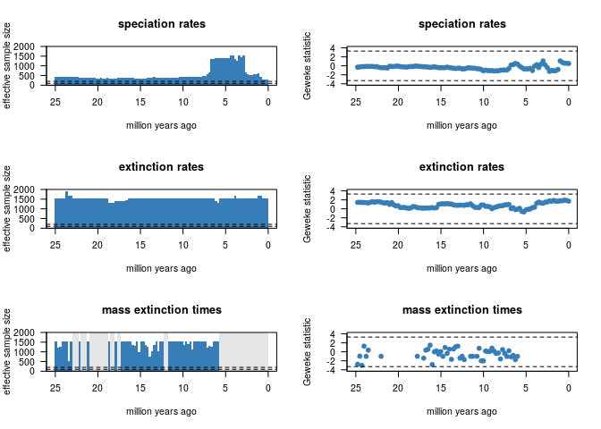<!-- -->

#### Plot the results

Plot the output:

``` r
layout.mat <- matrix(1:6,nrow=3,ncol=2,byrow=TRUE)
layout(layout.mat)
tess.plot.output(output_05_auto_stop,
fig.types = c("speciation rates",
"speciation shift times",
"extinction rates",
"extinction shift times",
"mass extinction Bayes factors",
"mass extinction times"),
las=2)
```

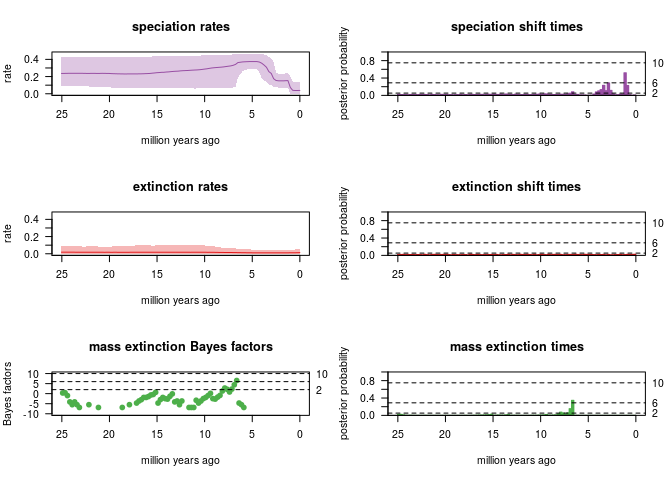<!-- -->

Save the plot in PDF:

``` r
pdf(paste0(path_to_output, "CoMET - Rate shift and sudden extinction of Monodoreae - 5pc chance survival - ", data_suffix, ".pdf"))
layout.mat <- matrix(1:6,nrow=3,ncol=2,byrow=TRUE)
layout(layout.mat)
tess.plot.output(output_05_auto_stop,
fig.types = c("speciation rates",
"speciation shift times",
"extinction rates",
"extinction shift times",
"mass extinction Bayes factors",
"mass extinction times"),
las=2)
dev.off()
```

    ## png 
    ##   2

#### Probability to survive a sudden extinction event = 10%

Set the hyperpriors on the survival probability. We assume a survival
probability of 5%, but should try with different values.

``` r
expectedSurvivalProbability <- 0.1
pMassExtinctionPriorShape2 <- 100
pMassExtinctionPriorShape1 <- - pMassExtinctionPriorShape2 *
expectedSurvivalProbability /
(expectedSurvivalProbability - 1)
# Plot the density function of our beta distribution.
{curve(dbeta(x,shape1=pMassExtinctionPriorShape1,
shape2=pMassExtinctionPriorShape2),n=1001,
xlab='survival probability',ylab='density',las=1)
# Plot the 95% prior interval on the survival probability.
abline(v = qbeta(c(0.025,0.975),shape1=pMassExtinctionPriorShape1,
shape2=pMassExtinctionPriorShape2),lty=2)
}
```

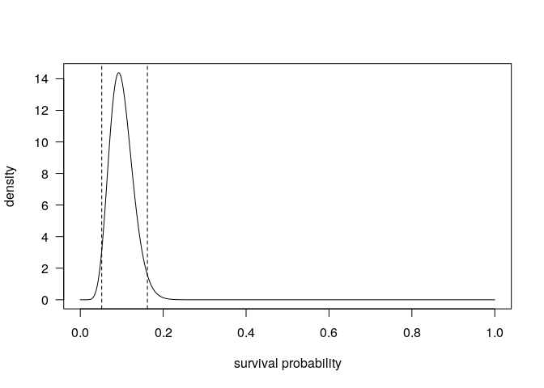<!-- -->

#### Run the CoMET analysis

``` r
tess.analysis(tree,
              empiricalHyperPriors = TRUE,
              samplingProbability = samplingFraction,
              numExpectedRateChanges = numExpectedRateChanges,
              numExpectedMassExtinctions = numExpectedMassExtinctions,
              pMassExtinctionPriorShape1 = pMassExtinctionPriorShape1,
              pMassExtinctionPriorShape2 = pMassExtinctionPriorShape2,
              MAX_ITERATIONS = 100000000,
              MIN_ESS = 500,
              MAX_TIME = 24*60*60,
              dir = paste0(path_to_output, "comet_10_auto_stop")) #676.132 sec elapsed
```

#### Assess the convergence

``` r
output_10_auto_stop <- tess.process.output(paste0(path_to_output, "comet_10_auto_stop"),
                                        numExpectedRateChanges = numExpectedRateChanges,
                                        numExpectedMassExtinctions = numExpectedMassExtinctions)
effectiveSize(output_10_auto_stop$numSpeciationCategories)
```

    ##     var1 
    ## 481.1744

``` r
layout.mat <- matrix(1:6,nrow=3,ncol=2,byrow=TRUE)
layout(layout.mat)
tess.plot.singlechain.diagnostics(output_10_auto_stop,
parameters = c("speciation rates",
"extinction rates",
"mass extinction times"),
las=2)
```

<!-- -->

#### Plot the results

Plot the output:

``` r
layout.mat <- matrix(1:6,nrow=3,ncol=2,byrow=TRUE)
layout(layout.mat)
tess.plot.output(output_10_auto_stop,
fig.types = c("speciation rates",
"speciation shift times",
"extinction rates",
"extinction shift times",
"mass extinction Bayes factors",
"mass extinction times"),
las=2)
```

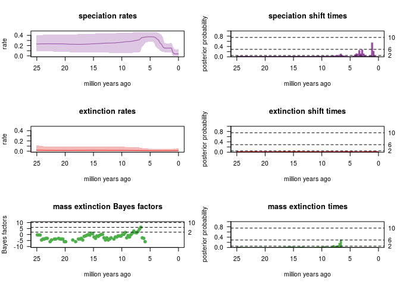<!-- -->

Save the plot in PDF:

``` r
pdf(paste0(path_to_output, "CoMET - Rate shift and sudden extinction of Monodoreae - 10pc chance survival - ", data_suffix, ".pdf"))
layout.mat <- matrix(1:6,nrow=3,ncol=2,byrow=TRUE)
layout(layout.mat)
tess.plot.output(output_10_auto_stop,
fig.types = c("speciation rates",
"speciation shift times",
"extinction rates",
"extinction shift times",
"mass extinction Bayes factors",
"mass extinction times"),
las=2)
dev.off()
```

    ## png 
    ##   2

#### Probability to survive a sudden extinction event = 15%

Set the hyperpriors on the survival probability. We assume a survival
probability of 5%, but should try with different values.

``` r
expectedSurvivalProbability <- 0.15
pMassExtinctionPriorShape2 <- 100
pMassExtinctionPriorShape1 <- - pMassExtinctionPriorShape2 *
expectedSurvivalProbability /
(expectedSurvivalProbability - 1)
# Plot the density function of our beta distribution.
{curve(dbeta(x,shape1=pMassExtinctionPriorShape1,
shape2=pMassExtinctionPriorShape2),n=1001,
xlab='survival probability',ylab='density',las=1)
# Plot the 95% prior interval on the survival probability.
abline(v = qbeta(c(0.025,0.975),shape1=pMassExtinctionPriorShape1,
shape2=pMassExtinctionPriorShape2),lty=2)
}
```

<!-- -->

#### Run the CoMET analysis

``` r
tess.analysis(tree,
              empiricalHyperPriors = TRUE,
              samplingProbability = samplingFraction,
              numExpectedRateChanges = numExpectedRateChanges,
              numExpectedMassExtinctions = numExpectedMassExtinctions,
              pMassExtinctionPriorShape1 = pMassExtinctionPriorShape1,
              pMassExtinctionPriorShape2 = pMassExtinctionPriorShape2,
              MAX_ITERATIONS = 100000000,
              MIN_ESS = 500,
              MAX_TIME = 24*60*60,
              dir = paste0(path_to_output, "comet_15_auto_stop")) #676.132 sec elapsed
```

#### Assess the convergence

``` r
output_15_auto_stop <- tess.process.output(paste0(path_to_output, "comet_15_auto_stop"),
                                        numExpectedRateChanges = numExpectedRateChanges,
                                        numExpectedMassExtinctions = numExpectedMassExtinctions)
effectiveSize(output_15_auto_stop$numSpeciationCategories)
```

    ##    var1 
    ## 437.583

``` r
layout.mat <- matrix(1:6,nrow=3,ncol=2,byrow=TRUE)
layout(layout.mat)
tess.plot.singlechain.diagnostics(output_15_auto_stop,
parameters = c("speciation rates",
"extinction rates",
"mass extinction times"),
las=2)
```

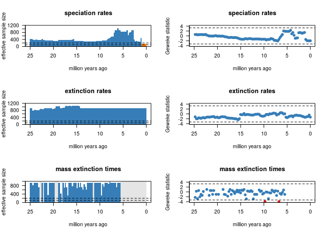<!-- -->

#### Plot the results

Plot the output:

``` r
layout.mat <- matrix(1:6,nrow=3,ncol=2,byrow=TRUE)
layout(layout.mat)
tess.plot.output(output_15_auto_stop,
fig.types = c("speciation rates",
"speciation shift times",
"extinction rates",
"extinction shift times",
"mass extinction Bayes factors",
"mass extinction times"),
las=2)
```

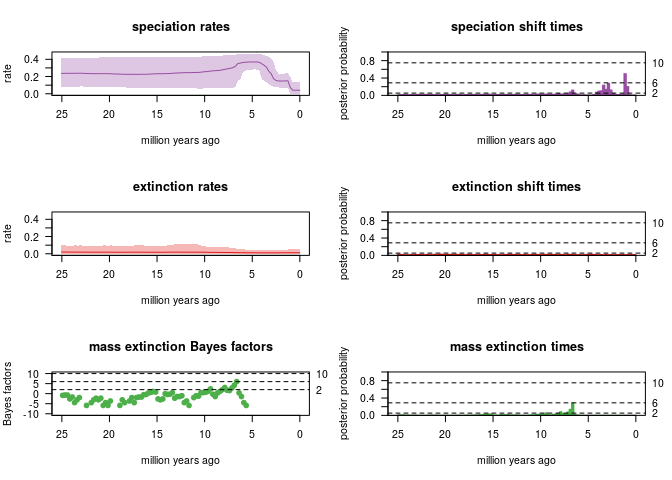<!-- -->

Save the plot in PDF:

``` r
pdf(paste0(path_to_output, "CoMET - Rate shift and sudden extinction of Monodoreae - 15pc chance survival - ", data_suffix, ".pdf"))
layout.mat <- matrix(1:6,nrow=3,ncol=2,byrow=TRUE)
layout(layout.mat)
tess.plot.output(output_15_auto_stop,
fig.types = c("speciation rates",
"speciation shift times",
"extinction rates",
"extinction shift times",
"mass extinction Bayes factors",
"mass extinction times"),
las=2)
dev.off()
```

    ## png 
    ##   2

#### Probability to survive a sudden extinction event = 20%

Set the hyperpriors on the survival probability. We assume a survival
probability of 5%, but should try with different values.

``` r
expectedSurvivalProbability <- 0.20
pMassExtinctionPriorShape2 <- 100
pMassExtinctionPriorShape1 <- - pMassExtinctionPriorShape2 *
expectedSurvivalProbability /
(expectedSurvivalProbability - 1)
# Plot the density function of our beta distribution.
{curve(dbeta(x,shape1=pMassExtinctionPriorShape1,
shape2=pMassExtinctionPriorShape2),n=1001,
xlab='survival probability',ylab='density',las=1)
# Plot the 95% prior interval on the survival probability.
abline(v = qbeta(c(0.025,0.975),shape1=pMassExtinctionPriorShape1,
shape2=pMassExtinctionPriorShape2),lty=2)
}
```

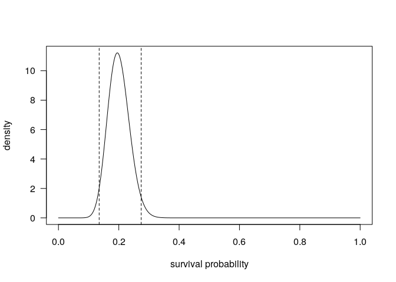<!-- -->

#### Run the CoMET analysis

``` r
tess.analysis(tree,
              empiricalHyperPriors = TRUE,
              samplingProbability = samplingFraction,
              numExpectedRateChanges = numExpectedRateChanges,
              numExpectedMassExtinctions = numExpectedMassExtinctions,
              pMassExtinctionPriorShape1 = pMassExtinctionPriorShape1,
              pMassExtinctionPriorShape2 = pMassExtinctionPriorShape2,
              MAX_ITERATIONS = 100000000,
              MIN_ESS = 500,
              MAX_TIME = 24*60*60,
              dir = paste0(path_to_output, "comet_20_auto_stop")) #676.132 sec elapsed
```

#### Assess the convergence

``` r
output_20_auto_stop <- tess.process.output(paste0(path_to_output, "comet_20_auto_stop"),
                                        numExpectedRateChanges = numExpectedRateChanges,
                                        numExpectedMassExtinctions = numExpectedMassExtinctions)
effectiveSize(output_20_auto_stop$numSpeciationCategories)
```

    ##     var1 
    ## 487.4879

``` r
layout.mat <- matrix(1:6,nrow=3,ncol=2,byrow=TRUE)
layout(layout.mat)
tess.plot.singlechain.diagnostics(output_20_auto_stop,
parameters = c("speciation rates",
"extinction rates",
"mass extinction times"),
las=2)
```

<!-- -->

#### Plot the results

Plot the output:

``` r
layout.mat <- matrix(1:6,nrow=3,ncol=2,byrow=TRUE)
layout(layout.mat)
tess.plot.output(output_20_auto_stop,
fig.types = c("speciation rates",
"speciation shift times",
"extinction rates",
"extinction shift times",
"mass extinction Bayes factors",
"mass extinction times"),
las=2)
```

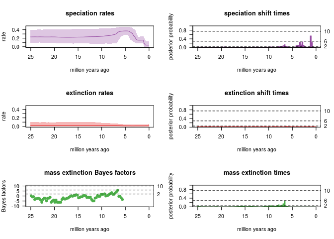<!-- -->

Save the plot in PDF:

``` r
pdf(paste0(path_to_output, "CoMET - Rate shift and sudden extinction of Monodoreae - 20pc chance survival - ", data_suffix, ".pdf"))
layout.mat <- matrix(1:6,nrow=3,ncol=2,byrow=TRUE)
layout(layout.mat)
tess.plot.output(output_20_auto_stop,
fig.types = c("speciation rates",
"speciation shift times",
"extinction rates",
"extinction shift times",
"mass extinction Bayes factors",
"mass extinction times"),
las=2)
dev.off()
```

    ## png 
    ##   2

#### Probability to survive a sudden extinction event = 25%

Set the hyperpriors on the survival probability. We assume a survival
probability of 5%, but should try with different values.

``` r
expectedSurvivalProbability <- 0.25
pMassExtinctionPriorShape2 <- 100
pMassExtinctionPriorShape1 <- - pMassExtinctionPriorShape2 *
expectedSurvivalProbability /
(expectedSurvivalProbability - 1)
# Plot the density function of our beta distribution.
{curve(dbeta(x,shape1=pMassExtinctionPriorShape1,
shape2=pMassExtinctionPriorShape2),n=1001,
xlab='survival probability',ylab='density',las=1)
# Plot the 95% prior interval on the survival probability.
abline(v = qbeta(c(0.025,0.975),shape1=pMassExtinctionPriorShape1,
shape2=pMassExtinctionPriorShape2),lty=2)
}
```

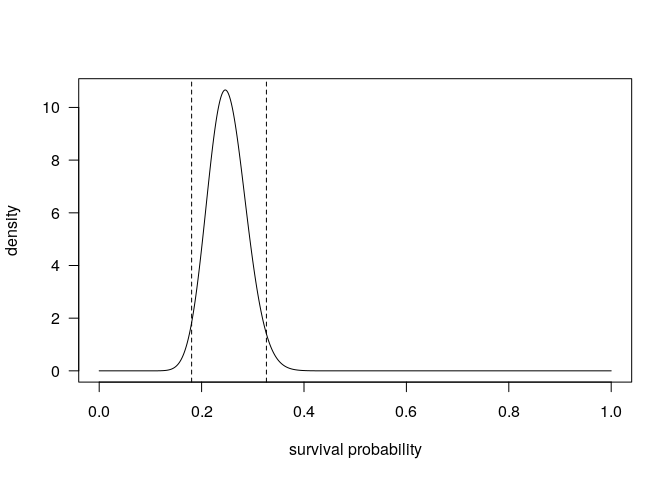<!-- -->

#### Run the CoMET analysis

``` r
tess.analysis(tree,
              empiricalHyperPriors = TRUE,
              samplingProbability = samplingFraction,
              numExpectedRateChanges = numExpectedRateChanges,
              numExpectedMassExtinctions = numExpectedMassExtinctions,
              pMassExtinctionPriorShape1 = pMassExtinctionPriorShape1,
              pMassExtinctionPriorShape2 = pMassExtinctionPriorShape2,
              MAX_ITERATIONS = 100000000,
              MIN_ESS = 500,
              MAX_TIME = 24*60*60,
              dir = paste0(path_to_output, "comet_25_auto_stop")) #676.132 sec elapsed
```

#### Assess the convergence

``` r
output_25_auto_stop <- tess.process.output(paste0(path_to_output, "comet_25_auto_stop"),
                                        numExpectedRateChanges = numExpectedRateChanges,
                                        numExpectedMassExtinctions = numExpectedMassExtinctions)
effectiveSize(output_25_auto_stop$numSpeciationCategories)
```

    ##     var1 
    ## 493.4519

``` r
layout.mat <- matrix(1:6,nrow=3,ncol=2,byrow=TRUE)
layout(layout.mat)
tess.plot.singlechain.diagnostics(output_25_auto_stop,
parameters = c("speciation rates",
"extinction rates",
"mass extinction times"),
las=2)
```

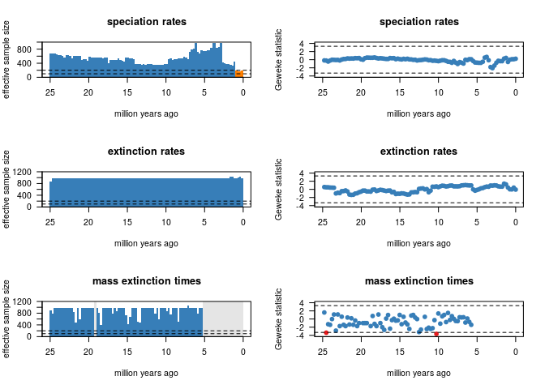<!-- -->

#### Plot the results

Plot the output:

``` r
layout.mat <- matrix(1:6,nrow=3,ncol=2,byrow=TRUE)
layout(layout.mat)
tess.plot.output(output_25_auto_stop,
fig.types = c("speciation rates",
"speciation shift times",
"extinction rates",
"extinction shift times",
"mass extinction Bayes factors",
"mass extinction times"),
las=2)
```

<!-- -->

Save the plot in PDF:

``` r
pdf(paste0(path_to_output, "CoMET - Rate shift and sudden extinction of Monodoreae - 25pc chance survival - ", data_suffix, ".pdf"))
layout.mat <- matrix(1:6,nrow=3,ncol=2,byrow=TRUE)
layout(layout.mat)
tess.plot.output(output_25_auto_stop,
fig.types = c("speciation rates",
"speciation shift times",
"extinction rates",
"extinction shift times",
"mass extinction Bayes factors",
"mass extinction times"),
las=2)
dev.off()
```

    ## png 
    ##   2

#### Probability to survive a sudden extinction event = 30%

Set the hyperpriors on the survival probability. We assume a survival
probability of 5%, but should try with different values.

``` r
expectedSurvivalProbability <- 0.3
pMassExtinctionPriorShape2 <- 100
pMassExtinctionPriorShape1 <- - pMassExtinctionPriorShape2 *
expectedSurvivalProbability /
(expectedSurvivalProbability - 1)
# Plot the density function of our beta distribution.
curve(dbeta(x,shape1=pMassExtinctionPriorShape1,
shape2=pMassExtinctionPriorShape2),n=1001,
xlab='survival probability',ylab='density',las=1)
# Plot the 95% prior interval on the survival probability.
abline(v = qbeta(c(0.025,0.975),shape1=pMassExtinctionPriorShape1,
shape2=pMassExtinctionPriorShape2),lty=2)
```

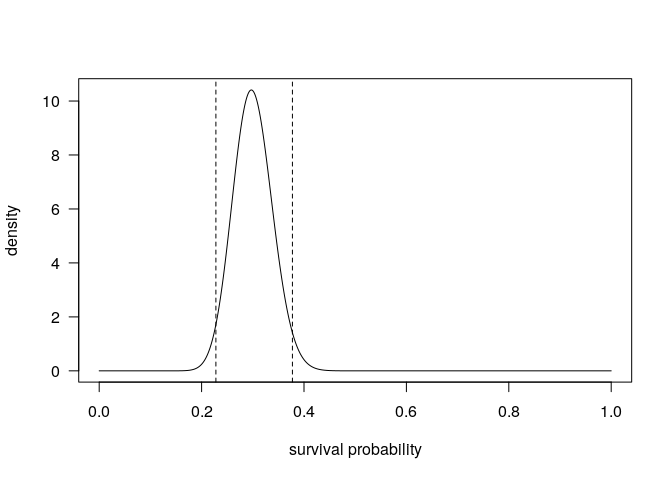<!-- -->

#### Run the CoMET analysis

``` r
tess.analysis(tree,
              empiricalHyperPriors = TRUE,
              samplingProbability = samplingFraction,
              numExpectedRateChanges = numExpectedRateChanges,
              numExpectedMassExtinctions = numExpectedMassExtinctions,
              pMassExtinctionPriorShape1 = pMassExtinctionPriorShape1,
              pMassExtinctionPriorShape2 = pMassExtinctionPriorShape2,
              MAX_ITERATIONS = 100000000,
              MIN_ESS = 500,
              MAX_TIME = 24*60*60,
              dir = paste0(path_to_output, "comet_30_auto_stop")) #676.132 sec elapsed
```

#### Assess the convergence

``` r
output_30_auto_stop <- tess.process.output(paste0(path_to_output, "comet_30_auto_stop"),
                                        numExpectedRateChanges = numExpectedRateChanges,
                                        numExpectedMassExtinctions = numExpectedMassExtinctions)
effectiveSize(output_30_auto_stop$numSpeciationCategories)
```

    ##     var1 
    ## 351.4053

``` r
layout.mat <- matrix(1:6,nrow=3,ncol=2,byrow=TRUE)
layout(layout.mat)
tess.plot.singlechain.diagnostics(output_30_auto_stop,
parameters = c("speciation rates",
"extinction rates",
"mass extinction times"),
las=2)
```

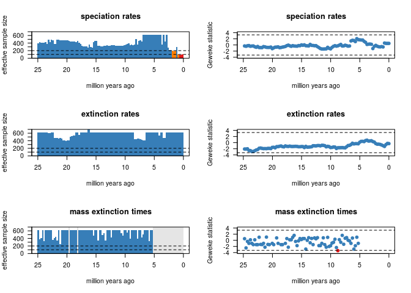<!-- -->

#### Plot the results

Plot the output:

``` r
layout.mat <- matrix(1:6,nrow=3,ncol=2,byrow=TRUE)
layout(layout.mat)
tess.plot.output(output_30_auto_stop,
fig.types = c("speciation rates",
"speciation shift times",
"extinction rates",
"extinction shift times",
"mass extinction Bayes factors",
"mass extinction times"),
las=2)
```

<!-- -->

Save the plot in PDF:

``` r
pdf(paste0(path_to_output, "CoMET - Rate shift and sudden extinction of Monodoreae - 30pc chance survival - ", data_suffix, ".pdf"))
layout.mat <- matrix(1:6,nrow=3,ncol=2,byrow=TRUE)
layout(layout.mat)
tess.plot.output(output_30_auto_stop,
fig.types = c("speciation rates",
"speciation shift times",
"extinction rates",
"extinction shift times",
"mass extinction Bayes factors",
"mass extinction times"),
las=2)
dev.off()
```

    ## png 
    ##   2

#### Probability to survive a sudden extinction event = 35%

Set the hyperpriors on the survival probability. We assume a survival
probability of 5%, but should try with different values.

``` r
expectedSurvivalProbability <- 0.35
pMassExtinctionPriorShape2 <- 100
pMassExtinctionPriorShape1 <- - pMassExtinctionPriorShape2 *
expectedSurvivalProbability /
(expectedSurvivalProbability - 1)
# Plot the density function of our beta distribution.
curve(dbeta(x,shape1=pMassExtinctionPriorShape1,
shape2=pMassExtinctionPriorShape2),n=1001,
xlab='survival probability',ylab='density',las=1)
# Plot the 95% prior interval on the survival probability.
abline(v = qbeta(c(0.025,0.975),shape1=pMassExtinctionPriorShape1,
shape2=pMassExtinctionPriorShape2),lty=2)
```

<!-- -->

#### Run the CoMET analysis

``` r
tess.analysis(tree,
              empiricalHyperPriors = TRUE,
              samplingProbability = samplingFraction,
              numExpectedRateChanges = numExpectedRateChanges,
              numExpectedMassExtinctions = numExpectedMassExtinctions,
              pMassExtinctionPriorShape1 = pMassExtinctionPriorShape1,
              pMassExtinctionPriorShape2 = pMassExtinctionPriorShape2,
              MAX_ITERATIONS = 100000000,
              MIN_ESS = 500,
              MAX_TIME = 24*60*60,
              dir = paste0(path_to_output, "comet_35_auto_stop")) #676.132 sec elapsed
```

#### Assess the convergence

``` r
output_35_auto_stop <- tess.process.output(paste0(path_to_output, "comet_35_auto_stop"),
                                        numExpectedRateChanges = numExpectedRateChanges,
                                        numExpectedMassExtinctions = numExpectedMassExtinctions)
effectiveSize(output_35_auto_stop$numSpeciationCategories)
```

    ##     var1 
    ## 373.3228

``` r
layout.mat <- matrix(1:6,nrow=3,ncol=2,byrow=TRUE)
layout(layout.mat)
tess.plot.singlechain.diagnostics(output_35_auto_stop,
parameters = c("speciation rates",
"extinction rates",
"mass extinction times"),
las=2)
```

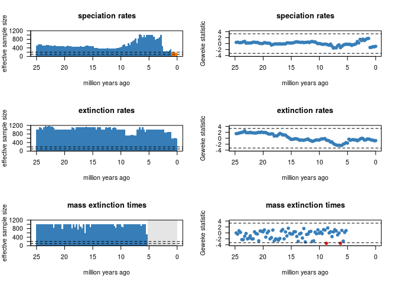<!-- -->

#### Plot the results

Plot the output:

``` r
layout.mat <- matrix(1:6,nrow=3,ncol=2,byrow=TRUE)
layout(layout.mat)
tess.plot.output(output_35_auto_stop,
fig.types = c("speciation rates",
"speciation shift times",
"extinction rates",
"extinction shift times",
"mass extinction Bayes factors",
"mass extinction times"),
las=2)
```

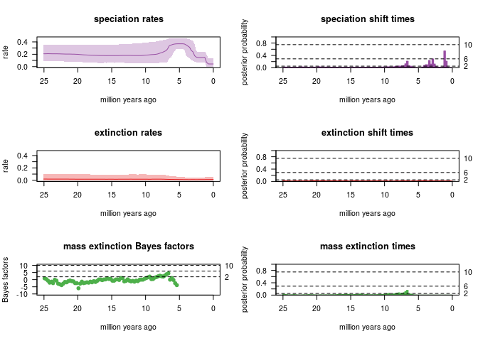<!-- -->

Save the plot in PDF:

``` r
pdf(paste0(path_to_output, "CoMET - Rate shift and sudden extinction of Monodoreae - 35pc chance survival - ", data_suffix, ".pdf"))
layout.mat <- matrix(1:6,nrow=3,ncol=2,byrow=TRUE)
layout(layout.mat)
tess.plot.output(output_35_auto_stop,
fig.types = c("speciation rates",
"speciation shift times",
"extinction rates",
"extinction shift times",
"mass extinction Bayes factors",
"mass extinction times"),
las=2)
dev.off()
```

    ## png 
    ##   2

#### Probability to survive a sudden extinction event = 40%

Set the hyperpriors on the survival probability. We assume a survival
probability of 5%, but should try with different values.

``` r
expectedSurvivalProbability <- 0.40
pMassExtinctionPriorShape2 <- 100
pMassExtinctionPriorShape1 <- - pMassExtinctionPriorShape2 *
expectedSurvivalProbability /
(expectedSurvivalProbability - 1)
# Plot the density function of our beta distribution.
curve(dbeta(x,shape1=pMassExtinctionPriorShape1,
shape2=pMassExtinctionPriorShape2),n=1001,
xlab='survival probability',ylab='density',las=1)
# Plot the 95% prior interval on the survival probability.
abline(v = qbeta(c(0.025,0.975),shape1=pMassExtinctionPriorShape1,
shape2=pMassExtinctionPriorShape2),lty=2)
```

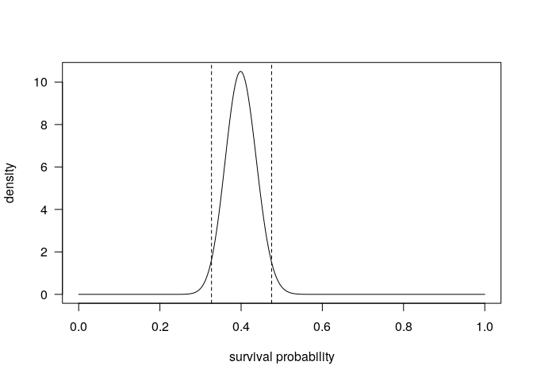<!-- -->

#### Run the CoMET analysis

``` r
tess.analysis(tree,
              empiricalHyperPriors = TRUE,
              samplingProbability = samplingFraction,
              numExpectedRateChanges = numExpectedRateChanges,
              numExpectedMassExtinctions = numExpectedMassExtinctions,
              pMassExtinctionPriorShape1 = pMassExtinctionPriorShape1,
              pMassExtinctionPriorShape2 = pMassExtinctionPriorShape2,
              MAX_ITERATIONS = 100000000,
              MIN_ESS = 500,
              MAX_TIME = 24*60*60,
              dir = paste0(path_to_output, "comet_40_auto_stop")) #676.132 sec elapsed
```

#### Assess the convergence

``` r
output_40_auto_stop <- tess.process.output(paste0(path_to_output, "comet_40_auto_stop"),
                                        numExpectedRateChanges = numExpectedRateChanges,
                                        numExpectedMassExtinctions = numExpectedMassExtinctions)
effectiveSize(output_40_auto_stop$numSpeciationCategories)
```

    ##     var1 
    ## 409.3846

``` r
layout.mat <- matrix(1:6,nrow=3,ncol=2,byrow=TRUE)
layout(layout.mat)
tess.plot.singlechain.diagnostics(output_40_auto_stop,
parameters = c("speciation rates",
"extinction rates",
"mass extinction times"),
las=2)
```

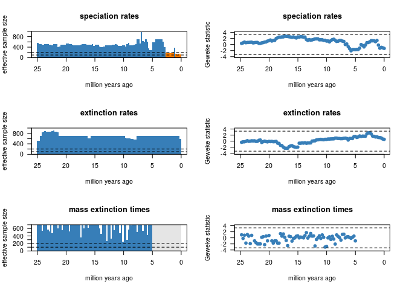<!-- -->

#### Plot the results

Plot the output:

``` r
layout.mat <- matrix(1:6,nrow=3,ncol=2,byrow=TRUE)
layout(layout.mat)
tess.plot.output(output_40_auto_stop,
fig.types = c("speciation rates",
"speciation shift times",
"extinction rates",
"extinction shift times",
"mass extinction Bayes factors",
"mass extinction times"),
las=2)
```

<!-- -->

Save the plot in PDF:

``` r
pdf(paste0(path_to_output, "CoMET - Rate shift and sudden extinction of Monodoreae - 40pc chance survival - ", data_suffix, ".pdf"))
layout.mat <- matrix(1:6,nrow=3,ncol=2,byrow=TRUE)
layout(layout.mat)
tess.plot.output(output_40_auto_stop,
fig.types = c("speciation rates",
"speciation shift times",
"extinction rates",
"extinction shift times",
"mass extinction Bayes factors",
"mass extinction times"),
las=2)
dev.off()
```

    ## png 
    ##   2

#### Probability to survive a sudden extinction event = 45%

Set the hyperpriors on the survival probability. We assume a survival
probability of 5%, but should try with different values.

``` r
expectedSurvivalProbability <- 0.45
pMassExtinctionPriorShape2 <- 100
pMassExtinctionPriorShape1 <- - pMassExtinctionPriorShape2 *
expectedSurvivalProbability /
(expectedSurvivalProbability - 1)
# Plot the density function of our beta distribution.
curve(dbeta(x,shape1=pMassExtinctionPriorShape1,
shape2=pMassExtinctionPriorShape2),n=1001,
xlab='survival probability',ylab='density',las=1)
# Plot the 95% prior interval on the survival probability.
abline(v = qbeta(c(0.025,0.975),shape1=pMassExtinctionPriorShape1,
shape2=pMassExtinctionPriorShape2),lty=2)
```

<!-- -->

#### Run the CoMET analysis

``` r
tess.analysis(tree,
              empiricalHyperPriors = TRUE,
              samplingProbability = samplingFraction,
              numExpectedRateChanges = numExpectedRateChanges,
              numExpectedMassExtinctions = numExpectedMassExtinctions,
              pMassExtinctionPriorShape1 = pMassExtinctionPriorShape1,
              pMassExtinctionPriorShape2 = pMassExtinctionPriorShape2,
              MAX_ITERATIONS = 100000000,
              MIN_ESS = 500,
              MAX_TIME = 24*60*60,
              dir = paste0(path_to_output, "comet_45_auto_stop")) #676.132 sec elapsed
```

#### Assess the convergence

``` r
output_45_auto_stop <- tess.process.output(paste0(path_to_output, "comet_45_auto_stop"),
                                        numExpectedRateChanges = numExpectedRateChanges,
                                        numExpectedMassExtinctions = numExpectedMassExtinctions)
effectiveSize(output_45_auto_stop$numSpeciationCategories)
```

    ##    var1 
    ## 440.133

``` r
layout.mat <- matrix(1:6,nrow=3,ncol=2,byrow=TRUE)
layout(layout.mat)
tess.plot.singlechain.diagnostics(output_45_auto_stop,
parameters = c("speciation rates",
"extinction rates",
"mass extinction times"),
las=2)
```

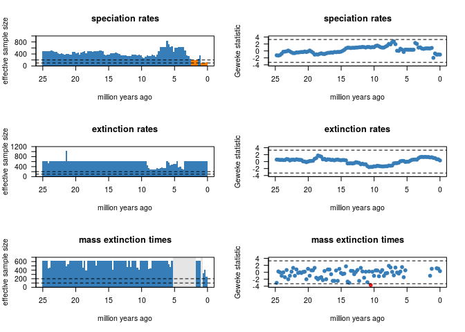<!-- -->

#### Plot the results

Plot the output:

``` r
layout.mat <- matrix(1:6,nrow=3,ncol=2,byrow=TRUE)
layout(layout.mat)
tess.plot.output(output_45_auto_stop,
fig.types = c("speciation rates",
"speciation shift times",
"extinction rates",
"extinction shift times",
"mass extinction Bayes factors",
"mass extinction times"),
las=2)
```

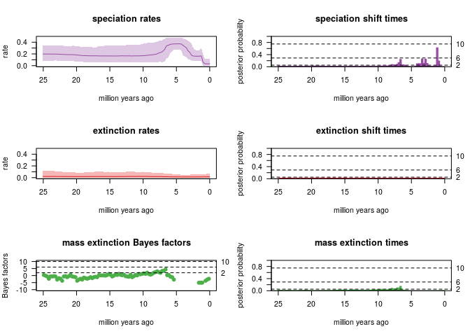<!-- -->

Save the plot in PDF:

``` r
pdf(paste0(path_to_output, "CoMET - Rate shift and sudden extinction of Monodoreae - 45pc chance survival - ", data_suffix, ".pdf"))
layout.mat <- matrix(1:6,nrow=3,ncol=2,byrow=TRUE)
layout(layout.mat)
tess.plot.output(output_45_auto_stop,
fig.types = c("speciation rates",
"speciation shift times",
"extinction rates",
"extinction shift times",
"mass extinction Bayes factors",
"mass extinction times"),
las=2)
dev.off()
```

    ## png 
    ##   2

#### Probability to survive a sudden extinction event = 50%

Set the hyperpriors on the survival probability. We assume a survival
probability of 5%, but should try with different values.

``` r
expectedSurvivalProbability <- 0.50
pMassExtinctionPriorShape2 <- 100
pMassExtinctionPriorShape1 <- - pMassExtinctionPriorShape2 *
expectedSurvivalProbability /
(expectedSurvivalProbability - 1)
# Plot the density function of our beta distribution.
curve(dbeta(x,shape1=pMassExtinctionPriorShape1,
shape2=pMassExtinctionPriorShape2),n=1001,
xlab='survival probability',ylab='density',las=1)
# Plot the 95% prior interval on the survival probability.
abline(v = qbeta(c(0.025,0.975),shape1=pMassExtinctionPriorShape1,
shape2=pMassExtinctionPriorShape2),lty=2)
```

<!-- -->

#### Run the CoMET analysis

``` r
tess.analysis(tree,
              empiricalHyperPriors = TRUE,
              samplingProbability = samplingFraction,
              numExpectedRateChanges = numExpectedRateChanges,
              numExpectedMassExtinctions = numExpectedMassExtinctions,
              pMassExtinctionPriorShape1 = pMassExtinctionPriorShape1,
              pMassExtinctionPriorShape2 = pMassExtinctionPriorShape2,
              MAX_ITERATIONS = 100000000,
              MIN_ESS = 500,
              MAX_TIME = 24*60*60,
              dir = paste0(path_to_output, "comet_50_auto_stop")) #676.132 sec elapsed
```

#### Assess the convergence

``` r
output_50_auto_stop <- tess.process.output(paste0(path_to_output, "comet_50_auto_stop"),
                                        numExpectedRateChanges = numExpectedRateChanges,
                                        numExpectedMassExtinctions = numExpectedMassExtinctions)
effectiveSize(output_50_auto_stop$numSpeciationCategories)
```

    ##     var1 
    ## 491.7884

``` r
layout.mat <- matrix(1:6,nrow=3,ncol=2,byrow=TRUE)
layout(layout.mat)
tess.plot.singlechain.diagnostics(output_50_auto_stop,
parameters = c("speciation rates",
"extinction rates",
"mass extinction times"),
las=2)
```

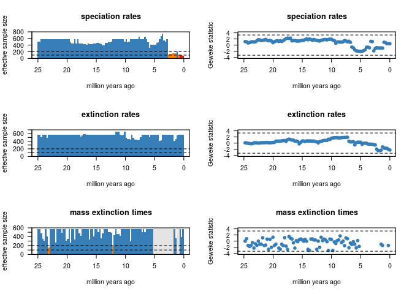<!-- -->

#### Plot the results

Plot the output:

``` r
layout.mat <- matrix(1:6,nrow=3,ncol=2,byrow=TRUE)
layout(layout.mat)
tess.plot.output(output_50_auto_stop,
fig.types = c("speciation rates",
"speciation shift times",
"extinction rates",
"extinction shift times",
"mass extinction Bayes factors",
"mass extinction times"),
las=2)
```

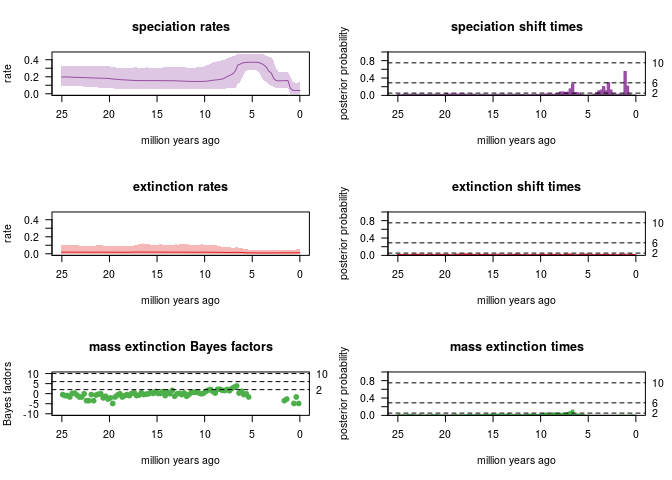<!-- -->

Save the plot in PDF:

``` r
pdf(paste0(path_to_output, "CoMET - Rate shift and sudden extinction of Monodoreae - 50pc chance survival - ", data_suffix, ".pdf"))
layout.mat <- matrix(1:6,nrow=3,ncol=2,byrow=TRUE)
layout(layout.mat)
tess.plot.output(output_50_auto_stop,
fig.types = c("speciation rates",
"speciation shift times",
"extinction rates",
"extinction shift times",
"mass extinction Bayes factors",
"mass extinction times"),
las=2)
dev.off()
```

    ## png 
    ##   2

### Interpretation

- Extinction rate is low, no rate shift detected
- sudden extinction:
  - the analysis strongly detects (2lnBF\>6) a ME event 6-7 My ago in
    case the *a priori* probability of survival to a ME event is 5% and
    10%
  - the analysis *substantially* detects a ME event in case the *a
    priori* probability of survival to a ME event is 15 - 30%
- Significant speciation rate shift detected \~2 My ago

#### Summarize the results for all the chances of survival

``` r
DF_ALL <- data.frame()
output_list <- list("5" = output_05_auto_stop,
                    "10" = output_10_auto_stop,
                    "15" = output_15_auto_stop,
                    "20" = output_20_auto_stop,
                    "25" = output_25_auto_stop,
                    "30" = output_30_auto_stop,
                    "35" = output_35_auto_stop,
                    "40" = output_40_auto_stop,
                    "45" = output_45_auto_stop,
                    "50" = output_50_auto_stop)
for (out in names(output_list)){
  output <-  output_list[[out]]
  # output <- output_10_auto_stop
  # load data.frame
  DF <- data.frame(int_up = output$intervals[-length(output$intervals)], int_low = output$intervals[-1])
  # speciation shifts
  DF$PP_sp_shifts <- colMeans(output[["speciation shift times"]])
  SS_criticalPP <- output[["speciationRateChangeCriticalPosteriorProbabilities"]]
  DF$SS_support <- ifelse(DF$PP_sp_shifts > SS_criticalPP[3], yes = "decisive", n = ifelse(DF$PP_sp_shifts > SS_criticalPP[2], yes = "strong", no = ifelse(DF$PP_sp_shifts > SS_criticalPP[1], yes = "substantial", no = "none")))
  DF$speciation_rate <- colMeans(output[["speciation rates"]])
  DF$speciation_rate_0025 <- apply(output[["speciation rates"]], 2, quantile, prob = c(0.025))
  DF$speciation_rate_0975 <- apply(output[["speciation rates"]], 2, quantile, prob = c(0.975))
  DF$speciation_shift <- NA
  for (i in 1:(nrow(DF)-1)){
    if (DF$SS_support[i] != "none"){
      if (DF$speciation_rate[i] > DF$speciation_rate[i+1]){
        DF$speciation_shift[i] <- "negative"
      }
      if (DF$speciation_rate[i] < DF$speciation_rate[i+1]){
        DF$speciation_shift[i] <- "positive"
      }
    }
  }
  # extinction shifts
  DF$PP_sp_shifts <- colMeans(output[["extinction shift times"]])
  ES_criticalPP <- output[["extinctionRateChangeCriticalPosteriorProbabilities"]]
  DF$ES_support <- ifelse(DF$PP_sp_shifts > ES_criticalPP[3], yes = "decisive", n = ifelse(DF$PP_sp_shifts > ES_criticalPP[2], yes = "strong", no = ifelse(DF$PP_sp_shifts > ES_criticalPP[1], yes = "substantial", no = "none")))
  # sudden extinction
  DF$PP_ME_times <- colMeans(output[["mass extinction times"]])
  ME_criticalPP <- output[["massExtinctionCriticalPosteriorProbabilities"]]
  DF$ME_support <- ifelse(DF$PP_ME_times > ME_criticalPP[3], yes = "decisive", n = ifelse(DF$PP_ME_times > ME_criticalPP[2], yes = "strong", no = ifelse(DF$PP_ME_times > ME_criticalPP[1], yes = "substantial", no = "none")))
  # survival percentage
  DF$survival_perc <- out
  DF_ALL <- rbind(DF_ALL, DF)
}
# retrieve the intervals:
ME_interval_all <- DF_ALL[which(DF_ALL$ME_support =="substantial" | DF_ALL$ME_support =="strong" | DF_ALL$SS_support =="substantial" | DF_ALL$SS_support =="strong"),c(10,1,2,9,4)]
# ME_interval_all

library(ggplot2)
library(dplyr)
speciation_rates_summary <- DF_ALL %>% group_by(int_low) %>%
  summarise(
    mean_speciation_rate = mean(speciation_rate),
    min_CI_speciation_rate = min(speciation_rate_0025),
    max_CI_speciation_rate = max(speciation_rate_0975),
    )
speciation_rates_summary <- rbind(speciation_rates_summary, c(DF_ALL$int_up[1], speciation_rates_summary$mean_speciation_rate[100], speciation_rates_summary$min_CI_speciation_rate[100], speciation_rates_summary$max_CI_speciation_rate[100]))
```

#### Plot of the sudden extinction events:

``` r
library(ggplot2)
library(ggtree)
# Support for ME events
ME_plot <- ggplot(data = DF_ALL)+
    geom_tree(data = tree, aes(x = 25.03657-x, y = y/1.7, node = node), color = "grey80")+
    geom_rect(aes(ymin = as.numeric(survival_perc)-0.5, ymax = as.numeric(survival_perc)+0.5, xmin = int_low, xmax = int_up, fill = ME_support))+
    scale_fill_manual(values = c(none = NULL, strong = "#d73027", substantial = "#fdae61"), name = "Support for ME event", na.value = "transparent", labels = c(strong = "Strong", substantial = "Substantial"))+
    scale_y_continuous(breaks = c(5,10,15,20,25,30,35,40,45,50), minor_breaks = c())+
    scale_x_reverse(breaks = seq(from = 0, to = 26, by = 1))+
    theme_bw() + xlab("Time") + ylab("Chance of survival to a sudden extinction event") + theme(panel.grid.major.y = element_blank())
ME_plot
```

<!-- -->

Save the plot in PDF:

``` r
pdf(paste0(path_to_output, "CoMET - Significant ME events of Monodoreae - ", data_suffix, ".pdf"), width = 10, height = 5)
ME_plot
dev.off()
```

    ## png 
    ##   2

#### Plot of the speciation shifts events

``` r
spec_shifts_plot <- ggplot(data = DF_ALL)+
  geom_tree(data = tree, aes(x = 25.03657-x, y = y/1.7, node = node), color = "grey80")+
  geom_rect(aes(ymin = as.numeric(survival_perc)-0.5, ymax = as.numeric(survival_perc)+0.5, xmin = int_low, xmax = int_up, fill = paste0(SS_support, "&", speciation_shift)))+
  scale_fill_manual(values = c("none&NA" = NULL, "strong&negative" = "#d73027", "substantial&negative" = "#fdae61", "substantial&positive" = "#74add1"), na.value = "transparent", name = "Support for a speciation rate shift", labels = c("none&NA" = NULL, "strong&negative" = "Strong (decreasing speciation)", "substantial&negative" = "Substantial (decreasing speciation)", "substantial&positive" = "Substantial (increasing speciation)"))+
  scale_y_continuous(breaks = c(5,10,15,20,25,30,35,40,45,50), minor_breaks = c())+
  scale_x_reverse(breaks = seq(from = 0, to = 26, by = 1))+
  theme_bw() + xlab("Time") + ylab("Chance of survival to a sudden extinction event") + theme(panel.grid.major.y = element_blank())
spec_shifts_plot
```

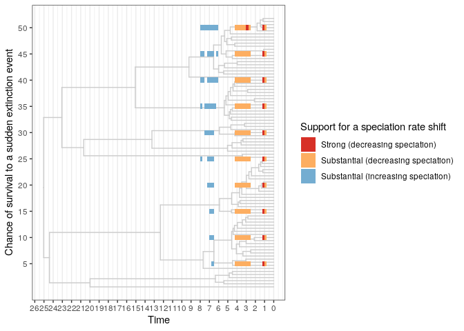<!-- -->

Save the plot in PDF:

``` r
pdf(paste0(path_to_output, "CoMET - Significant speciation shifts of Monodoreae - ", data_suffix, ".pdf"), width = 10, height = 5)
spec_shifts_plot
dev.off()
```

    ## png 
    ##   2

#### Plot ALL the shifts events and speciation rate

``` r
scale_fact = 100

all_shifts_plot <- ggplot(data = DF_ALL)+
  geom_tree(data = tree, aes(x = 25.03657-x, y = y/1.7, node = node), color = "grey80")+
  
  geom_line(data = speciation_rates_summary, aes(x = int_low, y = mean_speciation_rate*scale_fact), linetype = 1)+
  geom_ribbon(data = speciation_rates_summary, aes(x = int_low, ymin = min_CI_speciation_rate*scale_fact, ymax = max_CI_speciation_rate*scale_fact), fill = "grey80", alpha = 0.5)+
  
  geom_rect(aes(ymin = as.numeric(survival_perc)-0, ymax = as.numeric(survival_perc)+1, xmin = int_low, xmax = int_up, fill = paste0(SS_support, "&", speciation_shift)))+ #speciation shift
  geom_rect(aes(ymin = as.numeric(survival_perc)-1, ymax = as.numeric(survival_perc)+0, xmin = int_low, xmax = int_up, fill = ME_support))+ #sudden extinction event
  
  scale_fill_manual(values = c("none&NA" = NULL, "strong&negative" = "#d73027", "substantial&negative" = "#fdae61", "substantial&positive" = "#74add1", none = NULL, "strong" = "#762a83", "substantial" = "#af8dc3"), na.value = "transparent", name = "Event (support)", labels = c("none&NA" = NULL, "strong&negative" = "Speciation rate shift, decreasing (strong support)", "substantial&negative" = "Speciation rate shift, decresing (substantial support)", "substantial&positive" = "Speciation rate shift, increasing (subtantial support)", "strong" = "Sudden extinction (strong support)", "substantial" = "Sudden extinction (substantial support)"), breaks = c("strong&negative", "substantial&negative", "substantial&positive", "strong", "substantial"))+

  scale_y_continuous(breaks = c(5,10,15,20,25,30,35,40,45,50), minor_breaks = c(), sec.axis=sec_axis(~./scale_fact, name="Speciation rate (event/Myr)"))+
  scale_x_reverse(breaks = seq(from = 0, to = 25.5, by = 1), limits = c(25.5,-0.1), minor_breaks = seq(from = 0, to = 25.5, by = 0.5), expand = expansion(mult = 0.01, add = 0))+
  theme_bw() + xlab("Age (My)") + ylab("Chance of survival to a sudden extinction event") + theme(panel.grid.major.y = element_blank(),legend.justification = c(0,1), legend.position =  c(0.01,0.99))
# all_shifts_plot
```

Save the plot in PDF:

``` r
pdf(paste0(path_to_output, "CoMET - Speciation shifts and sudden extinction in Monodoreae - ", data_suffix, "_ALL.pdf"), width = 10, height = 6)
all_shifts_plot
dev.off()
```

    ## png 
    ##   2

##### Add geol time scale

``` r
library(deeptime)
GTS <- force(epochs)
lmio <-  c("Late Miocene", 11.6300, 5.3330, "L.Mio", "#FFFF66")
mmio <-  c("Middle Miocene", 15.9700, 11.6300, "M.Mio", "#FFFF4D")
emio <-  c("Early Miocene", 23.0300, 15.9700, "E.Mio", "#FFFF33")
GTS_perso <- rbind(GTS[c(1:3),], lmio, mmio, emio, GTS[5,])
GTS_perso$max_age <- as.numeric(GTS_perso$max_age)
GTS_perso$min_age <- as.numeric(GTS_perso$min_age)

all_shifts_plot_GTS = all_shifts_plot + coord_geo(neg = F, pos = "b", dat = GTS_perso, abbrv = F, height = unit(1, "line"), size = 3, bord = c(), skip = c("Holocene"), expand = T, center_end_labels = T)
all_shifts_plot_GTS
```

<!-- -->

Save the plot in PDF:

``` r
pdf(paste0(path_to_output, "CoMET - Speciation shifts and sudden extinction in Monodoreae - ", data_suffix, "_ALL_GTS.pdf"), width = 10, height = 6)
all_shifts_plot_GTS
dev.off()
```

    ## png 
    ##   2
