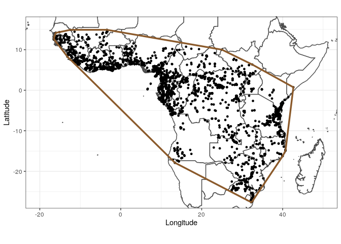
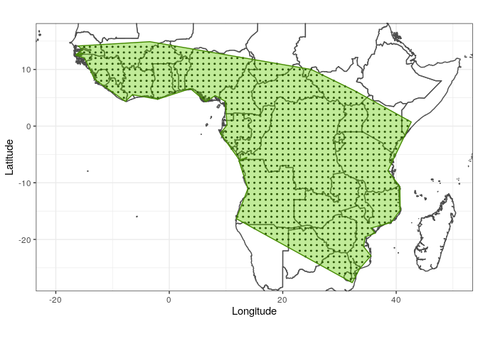
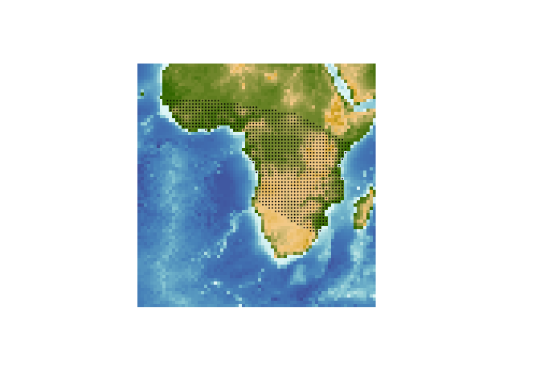
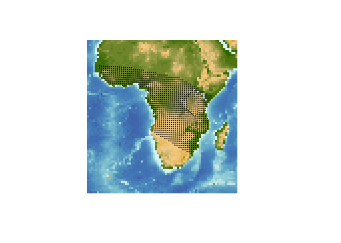
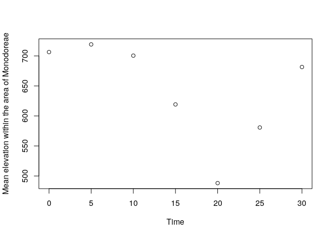

# PaleoElevation

**Author**: Léo-Paul Dagallier  
**Last update**: 2023-08-09

------------------------------------------------------------------------

The aim here is to retrieve the values of paleo elevation in Africa for
the different times from now back to 25 My ago. I will first retrieve
the values along the equator line, and will try to retrieve the values
that fall within the current Monodoreae distribution.

## Retrieve the data from [`chronosphere`](https://github.com/chronosphere-info/r_client) package

- ‘paleomap’: paleo Digital Elevation Models at 1 degree precision and
  by 5 My time slices
- ‘adminlines’: world administrative boundaries
- ‘africa’: Africa administrative boundaries
- ‘mod’: model for plate tectonics reconstruction. Will be used for
  reconstructing the past position of a current geo-referenced object
  (points, lines, polygons)

``` r
library(chronosphere)
paleomap = fetch(dat = "paleomap", var = "dem", res = "1")
adminlines = fetch(dat = "paleomap", var = "adminlines")
africa <- adminlines[which(adminlines$REGION_UN == "Africa"),]
mod <- fetch("paleomap", "model", ver="v3-GPlates")  
```

## Envelope of Monodoreae distribution

### Construct the current envelope of Monodoreae distribution

Retrieve the coordinates of Monodoreae from the [RAINBIO
database](https://gdauby.github.io/rainbio/index.html#dataset).

``` r
library(ggplot2)
path_to_rainbio = "your_path_to_rainbio/"
load(paste0(path_to_rainbio,"RAINBIO.RData"))
genlist <- c('Asteranthe',
             'Hexalobus',
             'Isolona',
             'Mischogyne',
             'Monocyclanthus',
             'Monodora',
             'Uvariastrum',
             'Uvariopsis',
             'Uvariodendron'
)
Monodoreae <- RAINBIO[which(RAINBIO$genus %in% genlist),]
ggplot(data = Monodoreae)+
  geom_polygon(data=africa, aes(x=long, y=lat, group = group), colour="gray30", fill="white") +
  geom_point(aes( x= decimalLongitude, y = decimalLatitude, color = genus), size = 1.4)+
  scale_color_manual(values = c('#a6cee3','#1f78b4','#b2df8a','#33a02c','#fb9a99','#e31a1c','#fdbf6f','#ff7f00','#cab2d6','#6a3d9a','#ffff99'))+
  coord_fixed(xlim=c(-20, 50),  ylim=c(-27, 16))+
  labs(x = "Longitude", y = "Latitude")+
  theme_bw()+
  theme(legend.position = "bottom")
```

 Create a polygon
containing all the Monodoreae occurrences.

``` r
library(grDevices)
envelope_coords <- Monodoreae[chull(Monodoreae[,c("decimalLongitude", "decimalLatitude")]),c("decimalLongitude", "decimalLatitude")]
library(sp)
SPenvelope <- SpatialPolygons(list(Polygons(list(Polygon(envelope_coords)), ID = "envelope")))
SPDFenvelope <- SpatialPolygonsDataFrame(SPenvelope, data = data.frame(Polygons = "Envelope", row.names = "envelope"))
ggplot(data = Monodoreae)+
  geom_polygon(data=africa, aes(x=long, y=lat, group = group), colour="gray30", fill="white") +
  geom_point(aes( x= decimalLongitude, y = decimalLatitude), size = 1)+
  geom_polygon(data = SPDFenvelope, aes(x=long, y=lat, group = group), color = "tan4", fill = "transparent", size = 1.2)+
  coord_fixed(xlim=c(-20, 50),  ylim=c(-27, 16))+
  labs(x = "Longitude", y = "Latitude")+
  theme_bw()
```



Retrieve the intersection between this envelope and the African
coastlines.

``` r
africa_CL <- raster::aggregate(africa[which(africa$Land_Type == "Primary land"),])
plot(africa_CL)
library(raster)
library(rgeos)
envelope_Afr <- gIntersection(SPDFenvelope, africa_CL)
envelope_Afr_simple <- gSimplify(envelope_Afr, tol = 0.9, topologyPreserve = F)

ggplot(data = Monodoreae)+
  geom_polygon(data=africa, aes(x=long, y=lat, group = group), colour="gray30", fill="white") +
  geom_point(aes( x= decimalLongitude, y = decimalLatitude), size = 1.4)+
  geom_polygon(data = envelope_Afr_simple, aes(x=long, y=lat, group = group), color = "chartreuse4", fill = "chartreuse3", alpha = 0.4)+
  geom_polygon(data = SPDFenvelope, aes(x=long, y=lat, group = group), color = "tan4", fill = "transparent")+
  coord_fixed(xlim=c(-20, 50),  ylim=c(-27, 16))+
  labs(x = "Longitude", y = "Latitude")+
  theme_bw()
```


### Retrieve all the points that fall within this envelope.

``` r
xmin <- floor(extent(envelope_Afr_simple)@xmin)
xmax <- floor(extent(envelope_Afr_simple)@xmax)
ymin <- floor(extent(envelope_Afr_simple)@ymin)
ymax <- floor(extent(envelope_Afr_simple)@ymax)
long <- rep(xmin:xmax, floor(ymax - ymin+1))
lat <- rep(ymin:ymax, floor(xmax - xmin+1))
XY <- data.frame(longitude = long, latitude = lat)

inter <- as.data.frame(gIntersection(SpatialPoints(XY),envelope_Afr_simple))

ggplot(data = inter)+
  geom_polygon(data=africa, aes(x=long, y=lat, group = group), colour="gray30", fill="white") +
  geom_point(aes( x= x, y = y), size = 0.4)+
  geom_polygon(data = envelope_Afr_simple, aes(x=long, y=lat, group = group), color = "chartreuse4", fill = "chartreuse3", alpha = 0.4)+
  coord_fixed(xlim=c(-20, 50),  ylim=c(-27, 16))+
  labs(x = "Longitude", y = "Latitude")+
  theme_bw()
```



### Reconstruct the envelope points back in time

``` r
ages = c(0,5,10,15,20,25, 30)
paleo_pts = list()
for (i in ages){
  i_pts <- chronosphere::reconstruct(inter, age = i, model = mod)
  i_pts <- list(i_pts)
  paleo_pts = c(paleo_pts, i_pts)
}
names(paleo_pts) <- ages
```

### Extract the paleo elevation for the paleo points

Crop the paleo DEM to Africa to ease visualization:

``` r
ext <- extent(c(
  xmin = -25,
  xmax = 50,
  ymin = -50,
  ymax = 25
))
paleo_africa <- crop(paleomap, ext)
mapplot(paleo_africa["0"], col = "earth")
points(paleo_pts$`0`, cex = 0.1)
mapplot(paleo_africa["30"], col = "earth")
points(paleo_pts$`30`, cex = 0.2)
```

  


Extract the values from the DEM that are overlayed by the ‘paleo
points’.

``` r
paleo_pts_elev = list()
for (i in ages){
  i_elev <- raster::extract(x = paleo_africa[as.character(i)], y = paleo_pts[[as.character(i)]])
  i_elev <- list(unlist(i_elev))
  if (any(i_elev[[1]] < 0)){ print(paste0("WARNING: negative values extracted for DEM at ", as.character(i)," My, check !"))}
  paleo_pts_elev <- c(paleo_pts_elev, i_elev)
}
names(paleo_pts_elev) <- ages
```

Check that there is no aberrant negative value.

Transform the list into dataframe.

``` r
time = NULL
elev = NULL
for (i in 1:length(paleo_pts_elev)){
  time <- c(time, rep(as.numeric(names(paleo_pts_elev[i])), length(paleo_pts_elev[[i]])))
  elev <- c(elev, paleo_pts_elev[[i]])
}
paleo_pts_elev_DF <- data.frame(time = time, elev = elev)
plot(paleo_pts_elev_DF$time, paleo_pts_elev_DF$elev, xlab = "Time", ylab = "Elevation within the area of Monodoreae")
```

Save the data into a text file:

Computes the mean and variance for the paleo elevations at each time
slice.

``` r
paleo_pts_elev_summary <- as.data.frame(cbind(age = names(paleo_pts_elev), mean = lapply(paleo_pts_elev, FUN = mean, na.rm = T), var = lapply(paleo_pts_elev, FUN = var, na.rm = T)))
plot(paleo_pts_elev_summary$age, paleo_pts_elev_summary$mean, xlab = "Time", ylab = "Mean elevation within the area of Monodoreae")
plot(paleo_pts_elev_summary$age, paleo_pts_elev_summary$var,  xlab = "Time", ylab = "Variance of the elevation  within the area of Monodoreae")
```



Save the data into a text file:

``` r
write.table(data.frame(sapply(paleo_pts_elev_summary, unlist)), file = "data/PaleoElev_Africa_pts_envelope_summary.txt", row.names = F)
```
