<!-- README.md is generated from README.Rmd. Please edit that file -->

# Macroevolution of the Monodoreae

**Author**: Léo-Paul Dagallier  
**Last update**: 2023-08-09

------------------------------------------------------------------------

<!-- badges: start -->
<!-- badges: end -->

This repository presents the biogeographic and diversification analyses
of the Monodoreae (Annonaceae family) carried out in Dagallier,
Condamine & Couvreur, in press.

Feel free to open an issue if you have any question.

If you make use of scripts published in this repository, please cite:

> **Dagallier L-PMJ, Condamine FL, Couvreur TLP (2023) A sequential diversification with Miocene extinction and Pliocene speciation linked to mountain uplift explains the diversity of the African rain forest clade Monodoreae (Annonaceae). Annals of Botany: mcad130. [https://doi.org/10.1093/aob/mcad130](https://academic.oup.com/aob/advance-article/doi/10.1093/aob/mcad130/7259080?utm_source=authortollfreelink&utm_campaign=aob&utm_medium=email&guestAccessKey=4f98ad38-aba4-4dd6-a097-a7f71e0d92f3)**


## Time-calibrate phylogenetic tree

The time-calibrated phylogenetic tree of the Monodoreae was
reconstructed in a Bayesian framework using BEAST and 2 fossil
calibration (see details in Material & Methods).

The tree:

``` r
library(ape)
library(phylotools)
library(ggtree)
library(ggplot2)
library(treeio)
library(tidyverse)
sub_table = read.table(file = "data/sub_table.txt")
treefile = c("MCC_monodoreae3_subset32var_ucld_ch1.tree")
tree <- treeio::read.beast(paste0("data/", treefile)) # reads the MCC tree in BEAST format
tree@phylo <- sub.taxa.label(tree@phylo, sub_table) # Replace the label name
write.beast(tree, file = paste0("data/name_", treefile)) # write the tree back in nexus format
```

Plot the tree with annotations:

``` r
# Define a custom geological time scale (GTS)
library(deeptime)
GTS <- force(epochs)
GTS_perso <- GTS
GTS_perso$name[2] = "Ple."
GTS_perso$name[3] = "Pli."

# Load geographical data
geo  <- read_tsv("data/geo_distribution_species.txt", col_names = c("label", "geo"), na = c("", "na"))
tree <- full_join(tree, geo, by = 'label')

gg = (ggtree(tree)  +
        # plot tree, HPD, node support, tips
    geom_range(range='height_0.95_HPD', alpha=.6, size=2, color='#695eff', center = 'height') +
    geom_nodelab(aes(x=x, label=round(height,2)), hjust=-.2, size=2) +
    geom_point2(aes(subset=!isTip & posterior <1, fill=cut(posterior, c(0, 0.9, 1))), shape=21, size=2, stroke = 0.3)+ 
    geom_nodelab(aes(x=x, label=round(posterior,2), subset=!isTip & posterior <1), size=0.8) +
    geom_tiplab(offset = 1, size = 2.5)+
      
      # geographical distribution
    geom_point2(aes(x = x+1, subset=isTip, color= geo), shape = 15, size = 2)+

      # fossils calibrations
    geom_point2(aes(subset=node %in% c(120, 119)), position = position_nudge(y = 4), shape = 25, fill = "#fb6a4a", stroke = 0, size = 3)+
    
      # annotations
    annotate(geom = "text", x = -90, y = 118, label = "Annonaceae", hjust = -0.05, vjust = 1, size = 5)+
    annotate(geom = "text", x = -25, y = 118, label = "Monodoreae", hjust = -0.05, vjust = 1, size = 5)+
    annotate(geom = "point", x = -120, y = 70, shape = 25, fill = "#fb6a4a", stroke = 0, size = 3)+
    annotate(geom = "text", x = -118, y = 70, label = "Fossil calibration point", hjust = 0)+
      
      # geological time scale
    coord_geo(neg = T, pos = "b", dat = GTS_perso, abbrv = F, height = unit(1, "line"), size = 2.7, bord = c(), skip = c( "Holocene"), center_end_labels = T, expand = T)+
    
      # layout elements
    theme_tree2() +
    scale_fill_manual(values=c("grey", "white"), guide='legend', 
                      name='Posterior Probability (PP)', 
                      breaks=c('(0.9,1]', '(0,0.9]'), 
                      labels=expression(0.9 <= PP * " < 1", PP < 0.9))+
          scale_color_manual(values = c("centre" = "#1f78b4", "east" = "#33a02c", "mada" = "#fdbf6f","west" = "#6a3d9a"), na.value = "transparent",
                       name = "Geographical distribution",
                       labels = c("centre" = "Central Africa", "east" = "East Africa", "mada" = "Madagascar","west" = "West Africa"))+
    theme(axis.line.x.bottom = element_line("#bdbdbd"),
          panel.grid.major.x = element_line("#bdbdbd"),
          panel.grid.minor.x = element_line("#f0f0f0"),
          legend.position=c(0.1, 0.8),
          legend.background = element_blank(),
          legend.key = element_blank())) %>% revts()+ scale_x_continuous(labels=abs, breaks = c(0,-20, -40, -60, -80, -100,  -120), limits = c(-120, 30)) +    geom_highlight(node=120, fill="steelblue", alpha=.1, to.bottom = T, xmin = -90) +    geom_highlight(node=126, fill="darkgreen", alpha=.2, to.bottom = T, xmin = -24.9)

# save as pdf
pdf(file = paste0("figures/", "name_MCC_monodoeae3_monod_full_Annon_GTS",".pdf"), width = 13 , height = 10)
gg
dev.off()
```

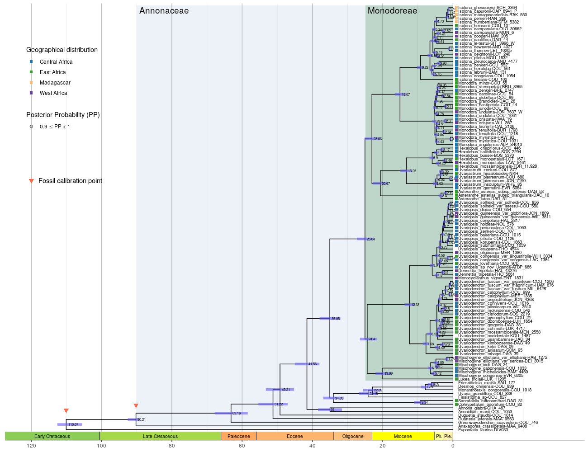 *This figure can be
viewed [here](figures/name_MCC_monodoeae3_monod_full_Annon_GTS.pdf)*

The downstream analysis will be run only on the Monodoreae. We thus need
to subset the Monodoreae tribe to the tree above.

Subset the Monodoreae tribe (node 126) from this dataset:

``` r
library(treeio)
tree_monod <- treeio::tree_subset(tree, node = 126, levels_back = 0)
write.tree(as.phylo(tree_monod), file = "data/name_MCC_monodoeae3_monod.newick")
```

## Biogeographic analysis

For the biogeographic analysis (ancestral range reconstruction), we need
only one representative per species (i.e. no variety or subspecies).
Remove the duplicates in the tree:

``` r
to_drop = c("Asteranthe_asterias_subsp_triangularis-DAG_10",
            "Hexalobus_monopetalus-LOT_1671",
            "Isolona_campanulata-MUN_6",
            "Mischogyne_elliotiana_var_sericea-DEI_3015",
            "Monodora_crispata-KWA_19",
            "Monodora_myristica-HAW_93",
            "Monodora_tenuifolia-BUR_1798",
            "Monodora_undulata-JON_7637_W",
            "Uvariastrum_pierreanum-JON_7190",
            "Uvariodendron_calophyllum-MER_1385",
            "Uvariodendron_fuscum_var_magnificum-HAM_676",
            "Uvariodendron_fuscum_var_fuscum-MIL_6428",
            "Uvariopsis_congensis_var_angustifolia-WHI_3334",
            "Uvariopsis_guineensis_var_globiflora-JON_1809",
            "Uvariopsis_solheidi_var_letestui-COU_550",
            "Dennettia_tripetala-HAL_43276")
tree_monod_pruned <- drop.tip(tree_monod, to_drop)
write.tree(as.phylo(tree_monod_pruned), file = "data/name_MCC_monodoreae3_monod_pruned.newick")
write.beast(tree_monod_pruned, file = "data/name_MCC_monodoreae3_monod_pruned.tree")
```

The details about the biogeographic analysis can be found here:
[`Biogeographic analyses`](Biogeography_DEC.md).

## Diversification analysis

### BAMM

Bayesian Analysis of Macroevolutionary Mixtures. All the analysis are
detailed here: [`BAMM`](BAMM.md).

No significant rate shift detected:  


The estimated **speciation** rate is constant across the time. It
appears higher for *Uvariopsis*: 

The estimated **extinction** rate is constant across the time:
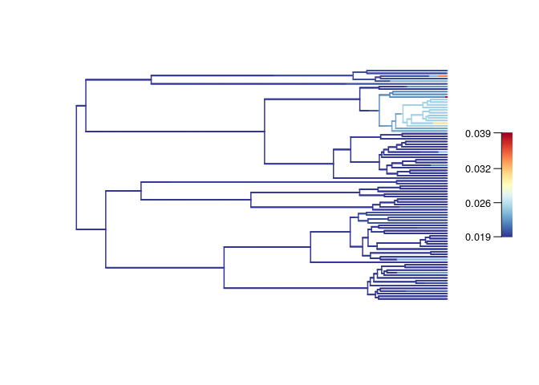

The estimated **net diversification** rate is constant across the time.
It appears higher for *Uvariopsis*: 

### ClaDS

Species-specific diversification rate shifts. See: [‘Maliet et
al. 2019’](http://www.nature.com/articles/s41559-019-0908-0) & [‘Maliet
& Morlon 2022’](https://doi.org/10.1093/sysbio/syab055).

All the analysis detailed here: [`ClaDS`](ClaDS.md).

The branch specific speciation rate is the highest for the species-rich
genus *Uvariopsis*, and high for the other species-rich genera
*Isolona*, *Monodora*, and *Uvariodendron*.  We observe a similar
pattern for the extinction rate, although the values are very low:
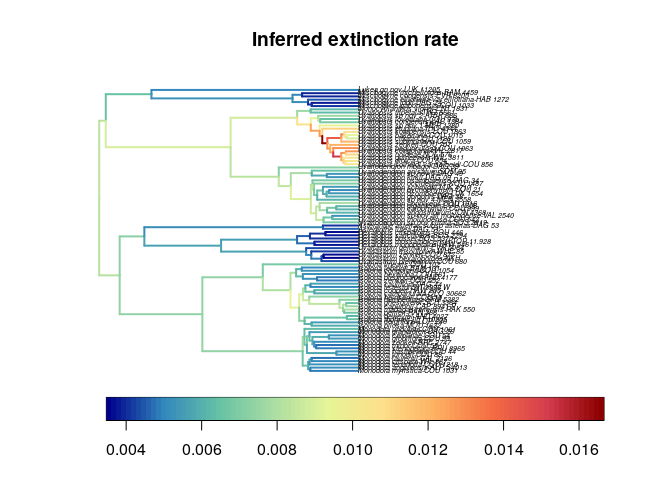

### RevBayes

#### Branch-Specific Diversification Rate Estimation (BSDR)

See [`RevBayes_BSDR`](RevBayes_BSDR.md).

With RevBayes, we find a similar result than ClaDS: speciation rate is
the highest for the species-rich genus *Uvariopsis*, and high for the
other species-rich genera *Isolona*, *Monodora*, and *Uvariodendron*.
Note that for *Isolona* and *Monodora*, the speciation rate is
particularly high at the root of the genera.  
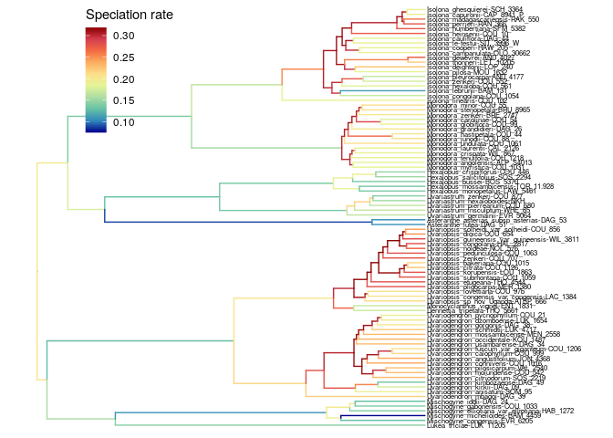

The extinction rate is very low.  
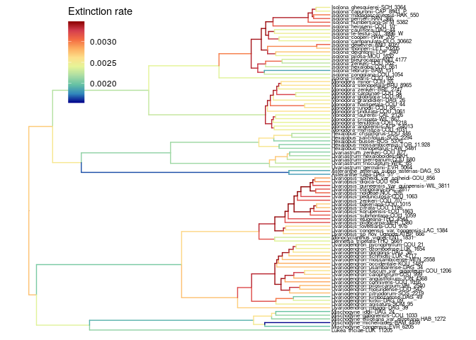

The net diversification rate is similar to the speciation rate.  
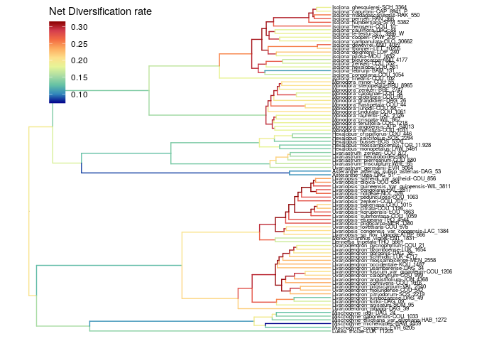

### CoMET

Results of the CoMET analysis. All the analysis detailed here:
[`CoMET`](CoMET.md).

With a probability of 5% to survive a mass extinction event:  
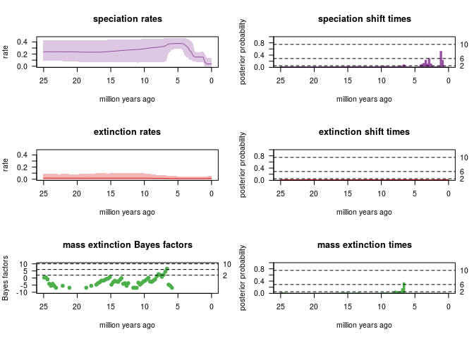

With a probability of 5% to survive a mass extinction event:  
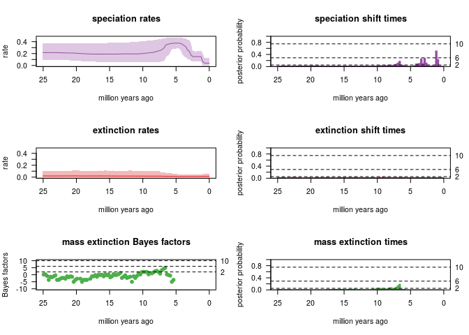

- Extinction rate is low, no rate shift detected
- Mass extinction:
  - the analysis strongly detects (2lnBF\>6) a ME event 6-7 My ago in
    case the *a priori* probability of survival to a ME event is 5%
  - the analysis *substantially* detects a ME event in case the *a
    priori* probability of survival to a ME event is 30%
- Significant speciation rate shift detected \~2 My ago

Summary of all the CoMET analysis:  \### RPANDA
Results of the RPANDA analysis. All the analysis detailed here:
[`RPANDA`](RPANDA.md).

#### Best time dependent model

The best fitting model appear to be the Pure Birth model with λ =
0.17495781 (AICc = 473.5). 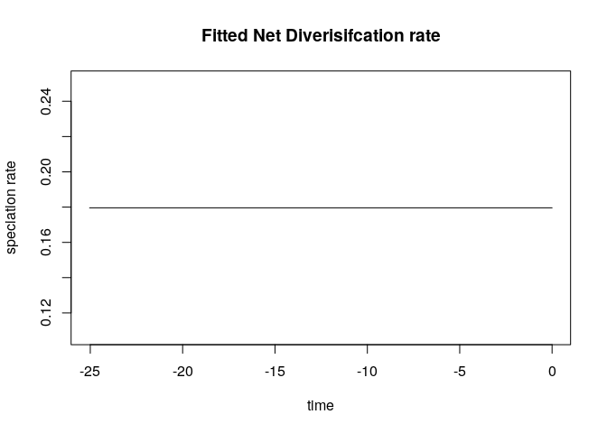

#### Best temperature dependent model

Temperature data from [Condamine et
al. 2015](https://doi.org/10.1186/s12862-015-0347-8).

The [best fitting model](RPANDA.md#Find-the-best-model-1) appear to be
the Pure Birth model with speciation varying exponentially with
temperatures: λ = 0.1255 and α = 0.0829 (AICc = 472.4, ΔAICc = 1.07).

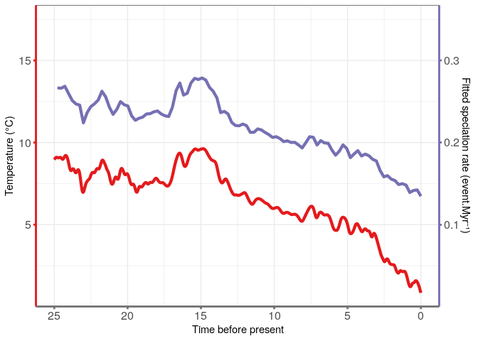

#### Best elevation dependent model

##### Elevation data

Paleo-elevation data retrieved from paleo-Digital Elevation Models
‘paleoDEMs’ from
[PaleoMaps](https://www.earthbyte.org/paleodem-resource-scotese-and-wright-2018/)
with the `chronosphere` package.

First, I retrieved the convex envelop of the distribution of the
Monodoreae tribe (from geo-referenced specimens). I then computed the
mean elevation of the African land within this envelope. I did so for
the current land elevation and for the past land elevation at times 5,
10, 15 20, 25 and 30 Myr before present. The PaleMap dataset doesn’t
have the paleoDEMs between these times. The geographic precision is 1
degree and the altitude precision is 40 meters. See
[PaleoElevation](PaleoElevation.md) for the details.

The [best fitting model](RPANDA.md#Find-the-best-model-2) appear to be
the Pure Birth model with speciation varying exponentially with
elevation: λ = 0.001725 and α = 0.0066 (AICc = 469.3, ΔAICc = 2.26).

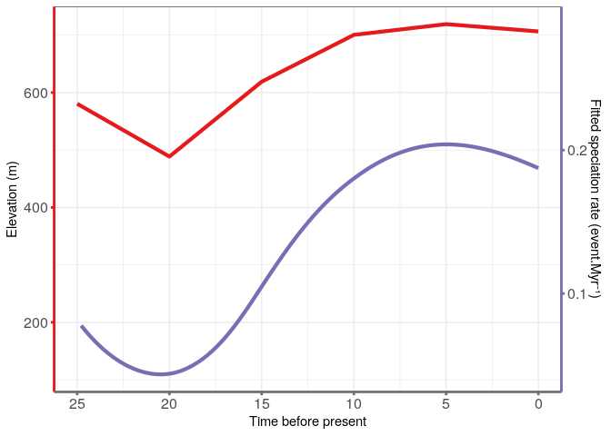

#### C4 fraction

Some best fitting models retrieve extinction rates higher than
speciation rates (leading to negative net diversification rates). These
models are unrealistic and are discarded. See [RPANDA_C4](RPANDA_C4.md)
and the main text in the article.
