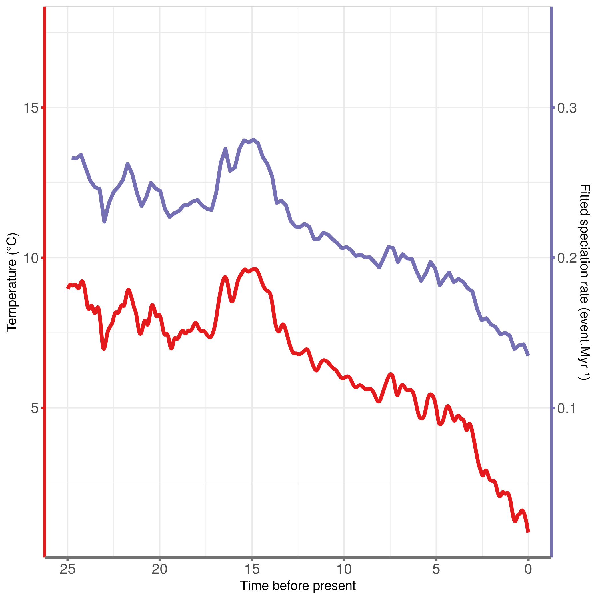
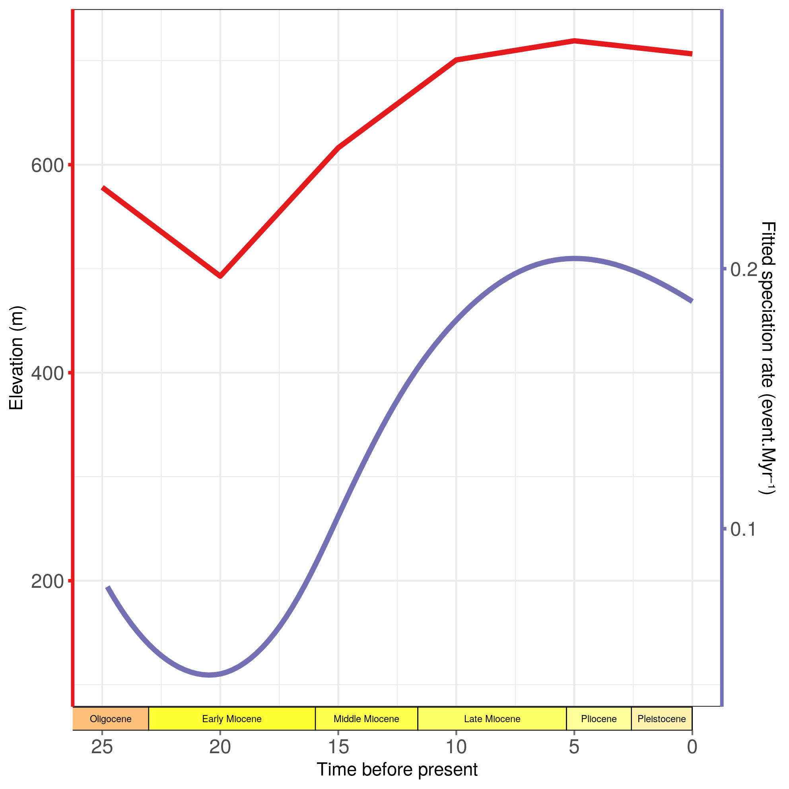

```{r setup, include=FALSE}
knitr::opts_chunk$set(echo = TRUE,
                      eval = F, warning=F, message=F,
                      fig.path  = "RPANDA_files/")
```

# RPANDA
**Author**: Léo-Paul Dagallier    
**Last update**: `r format(Sys.Date())`

***


## Input data

Prepare the output folder:

```{bash, eval = F}
path_to_output="outputs/";
cd $path_to_output
mkdir RPANDA_BD
```

Prepare the path variables: - in R:

```{r}
path_to_tree = c("data/name_MCC_monodoreae3_monod_pruned.newick")
path_to_output = c("outputs/RPANDA_BD/")
data_suffix <- "monodoreae3"
```

Read the tree:

```{r, message=F}
library(ape)
library(picante)
tree <-  read.tree(file = path_to_tree)
tot_time <- max(node.age(tree)$ages)
sampling_fraction <- 88/90
```

## Package installation and load

```{r, warning=FALSE, echo=FALSE, message=F}
install.packages("RPANDA")
library(RPANDA)
library(ape)
library(coda)
source(file ="R/plot_fit_env2.R")
```

# Constant rates and time-varying rates

## List of models to test:

λ = speciation\
µ = extinction

+-----------------+------------------------------+--------------------+
| λ               | µ                            | Model Acronym      |
+=================+==============================+====================+
| constant        | 0                            | BConst             |
+-----------------+------------------------------+--------------------+
| variable        | 0                            | BVar               |
+-----------------+------------------------------+--------------------+
| constant        | constant                     | BDConst            |
+-----------------+------------------------------+--------------------+
| variable        | constant                     | BVarDConst         |
+-----------------+------------------------------+--------------------+
| constant        | variable                     | BConstDVar         |
+-----------------+------------------------------+--------------------+
| variable        | variable                     | BDVar              |
+-----------------+------------------------------+--------------------+

If already run, load the results (to avoid re-running the models every time the rmarkdown is knitted):
```{r load-time-dep-models}
load(file = paste0(path_to_output, "time_dep_models"))
```

**Note that unfortunately, the models results objects could not be published in this repository because the files are to big.** You would thus need to run the models (`fit_bd` or `fit_env` functions) locally.

## Pure Birth with constant speciation (BConst)

Fit the pure birth model (no extinction) with a constant speciation rate.

```{r BConst, eval = F}
f.lamb <-function(t,y){y[1]}
f.mu<-function(t,y){0}
lamb_par<-c(0.09)
mu_par<-c()
result_BConst <- fit_bd(tree,tot_time,f.lamb,f.mu,lamb_par,mu_par,
                    f=sampling_fraction,cst.lamb=TRUE,fix.mu=TRUE,dt=1e-3)
result_BConst$model <- "BConst"
```


```{r BConst-plot}
t <- seq(0, tot_time, length.out = 100)
plot(-t, result_BConst$f.lamb(t), type = "l", xlab = "time", ylab = "speciation rate", main = "Fitted Net Diverisifcation rate")
```

Test the sensitivity of the initial parameter:

```{r BConst-sensit, eval = F}
f.lamb <-function(t,y){y[1]}
f.mu<-function(t,y){0}
lamb_post <- c()
lamb_init <-c()
mu_par<-c()
aicc <- c()
for (i in seq(from = 0.01, to = 1, by = 0.01)){
lamb_par<-c(i)
result_tmp <- fit_bd(tree,tot_time,f.lamb,f.mu,lamb_par,mu_par,
                    f=sampling_fraction,cst.lamb=TRUE,fix.mu=TRUE,dt=1e-3)
lamb_post <- c(lamb_post, result_tmp$lamb_par)
lamb_init <- c(lamb_init, i)
aicc <- c(aicc, result_tmp$aicc)
}
plot(lamb_post, lamb_init)
plot(density(lamb_post))
plot(density(aicc))
```

## Pure Birth with variable speciation (BVar)

Fit the pure birth model (no extinction) with a exponential variation of the speciation rate with time.

```{r BVar, eval = F}
f.lamb <-function(t,y){y[1] * exp(y[2] * t)}
f.mu<-function(t,y){0}
lamb_par<-c(0.05, 0.01)
mu_par<-c()
result_BVar <- fit_bd(tree,tot_time,f.lamb,f.mu,lamb_par,mu_par,
                    f=sampling_fraction,expo.lamb=TRUE,fix.mu=TRUE,dt=1e-3)
result_BVar$model <- "BVar"
```


```{r BVar-plot}
t <- seq(0, tot_time, length.out = 100)
plot(-t, result_BVar$f.lamb(t), type = "l", xlab = "time", ylab = "speciation rate", main = "Fitted Net Diverisifcation rate")
```

Test the sensitivity of the initial parameters:

```{r BVar-sensit, eval = F}
f.lamb <-function(t,y){y[1] * exp(y[2] * t)}
f.mu<-function(t,y){0}
lamb_post1 <- c()
lamb_post2 <- c()
lamb_init1 <-c()
lamb_init2 <-c()
mu_par<-c()
for (i in seq(from = 0.01, to = 0.2, by = 0.01)){
  for (j in seq(from = 0.01, to = 0.2, by = 0.01))
  lamb_par<-c(i, j)
  result_tmp <- fit_bd(tree,tot_time,f.lamb,f.mu,lamb_par,mu_par,
                     f=sampling_fraction,expo.lamb=TRUE,fix.mu=TRUE,dt=1e-3)
  lamb_post1 <- c(lamb_post1, result_tmp$lamb_par[1])
  lamb_post2 <- c(lamb_post2, result_tmp$lamb_par[2])
  lamb_init1 <- c(lamb_init1, i)
  lamb_init2 <- c(lamb_init2, i)
}
{par(mfrow = c(2,2))
plot(lamb_post1, lamb_init1)
plot(density(lamb_post1))
plot(lamb_post2, lamb_init2)
plot(density(lamb_post2))
}
```

## Birth Death model with constant rates (BDConst)

Fit the birth-death model with constant rates.

```{r BDConst, eval = F}
f.lamb <-function(t,y){y[1]}
f.mu<-function(t,y){y[1]}
lamb_par<-c(0.05)
mu_par<-c(0.01)
result_BDConst <- fit_bd(tree,tot_time,f.lamb,f.mu,lamb_par,mu_par,
                    f=sampling_fraction, cst.lamb = TRUE, cst.mu = TRUE,dt=1e-3)
result_BDConst$model <- "BDConst"
```

Plot the model:
```{r BDConst-plot}
par(mfrow = c(2,2))
t <- seq(0, tot_time, length.out = 100)
plot(-t, result_BDConst$f.lamb(t), type = "l", xlab = "time", ylab = "speciation rate", main = "Fitted speciation rate")
plot(-t, result_BDConst$f.mu(t), type = "l", xlab = "time", ylab = "extinction rate", main = "Fitted extinction rate")
plot(-t, result_BDConst$f.lamb(t) - result_BDConst$f.mu(t), type = "l", xlab = "time", ylab = "net diversification rate", main = "Fitted net diversification rate")
plot.new()
```

## Birth Death model with exponential variation of the speciation (BVarDConst)

Fit a birth-death model with exponential variation of the speciation and constant extinction

```{r BVarDConst, eval = F}
f.lamb <-function(t,y){y[1] * exp(y[2] * t)}
f.mu<-function(t,y){y[1]}
lamb_par<-c(0.5, 0.1)
mu_par<-c(0.01)
result_BVarDConst <- fit_bd(tree,tot_time,f.lamb,f.mu,lamb_par,mu_par,
                    f=sampling_fraction, expo.lamb = TRUE, cst.mu = TRUE,dt=1e-3)
result_BVarDConst$model <- "BVarDConst"
```

Plot the model:
```{r BVarDConst-plot}
t <- seq(0, tot_time, length.out = 100)
par(mfrow = c(2,2))
plot(-t, result_BVarDConst$f.lamb(t), type = "l", xlab = "time", ylab = "speciation rate", main = "Fitted speciation rate")
plot(-t, result_BVarDConst$f.mu(t), type = "l", xlab = "time", ylab = "extinction rate", main = "Fitted extinction rate")
plot(-t, result_BVarDConst$f.lamb(t) - result_BVarDConst$f.mu(t), type = "l", xlab = "time", ylab = "net diversification rate", main = "Fitted net diversification rate")
plot.new()
```

## Birth Death model with constant speciation and exponential variation of the extinction (BConstDVar)

Fit a birth-death model with constant speciation and exponential variation of the extinction.

```{r BConstDVar, eval = F}
f.lamb <-function(t,y){y[1]}
f.mu<-function(t,y){y[1] * exp(y[2] * t)}
lamb_par<-c(0.01)
mu_par<-c(0.1, 0.01)
result_BConstDVar <- fit_bd(tree,tot_time,f.lamb,f.mu,lamb_par,mu_par,
                    f=sampling_fraction, cst.lamb = TRUE, expo.mu = TRUE,dt=1e-3)
result_BConstDVar$model <- "BConstDVar"
```

Plot the model:
```{r BConstDVar-plot}
t <- seq(0, tot_time, length.out = 100)
{par(mfrow = c(2,2))
plot(-t, result_BConstDVar$f.lamb(t), type = "l", xlab = "time", ylab = "speciation rate", main = "Fitted speciation rate")
plot(-t, result_BConstDVar$f.mu(t), type = "l", xlab = "time", ylab = "extinction rate", main = "Fitted extinction rate")
plot(-t, result_BConstDVar$f.lamb(t) - result_BConstDVar$f.mu(t), type = "l", xlab = "time", ylab = "net diversification rate", main = "Fitted net diversification rate")
plot.new()
}
```

## Birth Death model with exponential variation of both the speciation and the extinction rates (BDVar)

```{r BDVar, eval = F}
f.lamb <-function(t,y){y[1] * exp(y[2] * t)}
f.mu<-function(t,y){y[1] * exp(y[2] * t)}
lamb_par<-c(0.5, 0.1)
mu_par<-c(0.4, 0.1)
result_BDVar <- fit_bd(tree,tot_time,f.lamb,f.mu,lamb_par,mu_par,
                    f=sampling_fraction, expo.lamb = TRUE, expo.mu = TRUE,dt=1e-3)
result_BDVar$model <- "BDVar"
```

Plot the model:
```{r BDVar-plot}
t <- seq(0, tot_time, length.out = 100)
par(mfrow = c(2,2))
plot(-t, result_BDVar$f.lamb(t), type = "l", xlab = "time", ylab = "speciation rate", main = "Fitted speciation rate")
plot(-t, result_BDVar$f.mu(t), type = "l", xlab = "time", ylab = "extinction rate", main = "Fitted extinction rate")
plot(-t, result_BDVar$f.lamb(t) - result_BDVar$f.mu(t), type = "l", xlab = "time", ylab = "net diversification rate", main = "Fitted net diversification rate")
plot.new()
```

## Find the best model

```{r time-dep-models-list, eval = F}
models_list <- list(result_BConst, result_BVar, result_BDConst, result_BVarDConst, result_BConstDVar, result_BDVar)
```


```{r time-dep-models-save, eval = F}
save(models_list, file = paste0(path_to_output, "time_dep_models"))
```


```{r time-dep-best-model}
load(file = paste0(path_to_output, "time_dep_models"))
AICc <- c()
model <- c()
lambda <- c()
alpha <- c()
LH <- c()
mu <- c()
beta <- c()

for (m in models_list){
  AICc = c(AICc, m$aicc)
  model = c(model, m$model)
  LH = c(LH, m$LH)
  lambda = c(lambda, m$lamb_par[1])
  if (!is.na(m$lamb_par[2])){
     alpha = c(alpha, m$lamb_par[2])
  } else{alpha = c(alpha, NA)}
    if(!is.null(m$mu_par)){
      mu = c(mu, m$mu_par[1])
      if (!is.na(m$mu_par[2])){
        beta = c(beta, m$mu_par[2])
      } else{beta = c(beta, NA)}
    } else{mu = c(mu, NA)
    beta = c(beta, NA)}
}
model_compare <- data.frame(model = model, LH = LH, AICc = AICc, Lambda = lambda, Alpha= alpha, Mu = mu, Beta = beta)
model_compare <- model_compare[order(model_compare$AICc),] # sort on AICc values
model_compare$dAICc <- model_compare$AICc - min(model_compare$AICc)
model_compare
```

The best fitting model appear to be the Pure Birth model with λ = 0.17495781.

```{r plot-time-dep-best-model}
result_BConst$lamb_par
plot_dtt(result_BConst,tot_time,N0=92)
```

Export the table:
```{r, eval = F}
write.csv(model_compare, file = paste0(path_to_output, "time_models_compare.csv"), quote = F)
```

# Environment dependent models

## Temperature

### Load temperature data

Temperature from [Condamine et al. 2015](https://doi.org/10.1186/s12862-015-0347-8).

```{r load-temp}
data(InfTemp)
range(InfTemp$Age)
```

### List of models to test

λ = speciation\
µ = extinction

+------------------+----------------------+----------------------------+
| λ                | µ                    | Model Acronym              |
+==================+======================+============================+
| constant         | 0                    | BConst                     |
+------------------+----------------------+----------------------------+
| time             | 0                    | BTime                      |
+------------------+----------------------+----------------------------+
| constant         | constant             | BDConst                    |
+------------------+----------------------+----------------------------+
| time             | constant             | BTimeDConst                |
+------------------+----------------------+----------------------------+
| constant         | time                 | BConstDTime                |
+------------------+----------------------+----------------------------+
| time             | time                 | BDTime                     |
+------------------+----------------------+----------------------------+
| temperature      | O                    | BTemp                      |
+------------------+----------------------+----------------------------+
| temperature      | constant             | BTempDConst                |
+------------------+----------------------+----------------------------+
| constant         | temperature          | BConstDTemp                |
+------------------+----------------------+----------------------------+
| temperature      | temperature          | BDTemp                     |
+------------------+----------------------+----------------------------+

If already run, load the results (to avoid re-running the models every time the rmarkdown is knitted):
```{r load-temp-models}
load(file = paste0(path_to_output, "temp_models"))
```

### Pure Birth with constant speciation (BConst)

Fit the pure birth model (no extinction) with a constant speciation rate with time.

```{r temp-BConst, eval = F}
f.lamb <-function(t,x,y){y[1]+ 0*t}
f.mu<-function(t,x,y){0}
lamb_par<-c(0.1)
mu_par<-c()
result_BConst <- fit_env(tree,InfTemp,tot_time,f.lamb,f.mu,lamb_par,mu_par,
                    f=sampling_fraction,expo.lamb=FALSE,fix.mu=TRUE,dt=1e-3)
result_BConst$model <- "BConst"
```

Plot the model:
```{r temp-BConst-plot}
source(file ="R/plot_fit_env2.R")
plot_fit_env2(result_BConst, InfTemp, tot_time = tot_time)
```

### Pure Birth with variable speciation (BTime)

Fit the pure birth model (no extinction) with a exponential variation of the speciation rate with time.

```{r temp-BTime, eval = F}
f.lamb <-function(t,x,y){y[1] * exp(y[2] * t)}
f.mu<-function(t,x,y){0}
lamb_par<-c(0.1, 0.01)
mu_par<-c()
result_BTime <- fit_env(tree,InfTemp,tot_time,f.lamb,f.mu,lamb_par,mu_par,
                    f=sampling_fraction,expo.lamb=TRUE,fix.mu=TRUE,dt=1e-3)
result_BTime$model <- "BTime"
```

Plot the model:
```{r temp-BTime-plot}
plot_fit_env2(result_BTime, InfTemp, tot_time = tot_time)
```

### Birth Death model with constant rates (BDConst)

Fit the birth-death model with constant rates.

```{r temp-BDConst, eval = F}
f.lamb <-function(t,x,y){y[1]+0*x}
f.mu<-function(t,x,y){y[1+0*x]}
lamb_par<-c(0.05)
mu_par<-c(0.01)
result_BDConst <- fit_env(tree,InfTemp,tot_time,f.lamb,f.mu,lamb_par,mu_par,
                    f=sampling_fraction, cst.lamb = TRUE, cst.mu = TRUE,dt=1e-3)
result_BDConst$model <- "BDConst"
```

Plot the model:
```{r temp-BDConst-plot}
plot_fit_env2(result_BDConst, InfTemp, tot_time)
```

### Birth Death model with exponential variation of the speciation (BTimeDConst)

Fit a birth-death model with exponential variation of the speciation and constant extinction

```{r temp-BTimeDConst, eval = F}
f.lamb <-function(t,x,y){y[1] * exp(y[2] * t)}
f.mu<-function(t,x,y){y[1]+0*x}
lamb_par<-c(0.5, 0.1)
mu_par<-c(0.01)
result_BTimeDConst <- fit_env(tree,InfTemp,tot_time,f.lamb,f.mu,lamb_par,mu_par,
                    f=sampling_fraction, expo.lamb = TRUE, cst.mu = TRUE,dt=1e-3)
result_BTimeDConst$model <- "BTimeDConst"
```

Plot the model:
```{r temp-BTimeDConst-plot}
plot_fit_env2(result_BTimeDConst, InfTemp, tot_time)
```

### Birth Death model with constant speciation and exponential variation of the extinction (BConstDTime)

Fit a birth-death model with constant speciation and exponential variation of the extinction.

```{r temp-BConstDTime, eval = F}
f.lamb <-function(t,x,y){y[1]+0*x}
f.mu<-function(t,x,y){y[1] * exp(y[2] * t)}
lamb_par<-c(0.01)
mu_par<-c(0.1, 0.01)
result_BConstDTime <- fit_env(tree,InfTemp,tot_time,f.lamb,f.mu,lamb_par,mu_par,
                    f=sampling_fraction, cst.lamb = TRUE, expo.mu = TRUE,dt=1e-3)
result_BConstDTime$model <- "BConstDTime"
```


```{r temp-BConstDTime-plot}
plot_fit_env2(result_BConstDTime, InfTemp, tot_time)
```

### Birth Death model with exponential variation of both the speciation and the extinction rates (BDTime)

```{r temp-BDTime, eval = F}
f.lamb <-function(t,x,y){y[1] * exp(y[2] * t)}
f.mu<-function(t,x,y){y[1] * exp(y[2] * t)}
lamb_par<-c(0.1, 0.1)
mu_par<-c(0.01, 0.01)
result_BDTime <- fit_env(tree,InfTemp,tot_time,f.lamb,f.mu,lamb_par,mu_par,
                    f=sampling_fraction, expo.lamb = TRUE, expo.mu = TRUE,dt=1e-3)
result_BDTime$model <- "BDTime"
```

Plot the model:
```{r temp-BDTime-plot}
plot_fit_env2(result_BDTime, InfTemp, tot_time)
```

### Birth Death model with speciation varying as an exponential of temperature and no extinction (Btemp)

```{r temp-BTemp, eval = F}
f.lamb <-function(t,x,y){y[1] * exp(y[2] * x)}
f.mu<-function(t,x,y){0}
lamb_par<-c(0.1, 0.01)
mu_par<-c()
result_BTemp <- fit_env(tree,InfTemp,tot_time,f.lamb,f.mu,lamb_par,mu_par,
                    f=sampling_fraction, fix.mu = TRUE,dt=1e-3)
result_BTemp$model <- "BTemp"
```

Plot the model:
```{r temp-BTemp-plot}
plot_fit_env2(result_BTemp, InfTemp, tot_time)
```

### Birth Death model with speciation varying as an exponential of temperature and constant extinction (BtempDConst)

```{r temp-BTempDConst, eval = F}
f.lamb <-function(t,x,y){y[1] * exp(y[2] * x)}
f.mu<-function(t,x,y){y[1] + 0*x}
lamb_par<-c(0.1, 0.01)
mu_par<-c(0.1)
result_BTempDConst <- fit_env(tree,InfTemp,tot_time,f.lamb,f.mu,lamb_par,mu_par,
                    f=sampling_fraction,dt=1e-3)
result_BTempDConst$model <- "BTempDConst"
```

Plot the model:
```{r temp-BTempDConst-plot}
plot_fit_env2(result_BTempDConst, InfTemp, tot_time)
```

### Birth Death model with speciation constant and extinction varying as an exponential of temperature (BConstDTemp)

```{r temp-BConstDTemp, eval = F}
f.lamb <-function(t,x,y){y[1] + 0*x}
f.mu<-function(t,x,y){y[1] * exp(y[2] * x)}
lamb_par<-c(0.1)
mu_par<-c(0.1, 0.01)
result_BConstDTemp <- fit_env(tree,InfTemp,tot_time,f.lamb,f.mu,lamb_par,mu_par,
                    f=sampling_fraction,dt=1e-3)
result_BConstDTemp$model <- "BConstDTemp"
```


```{r temp-BConstDTemp-plot}
plot_fit_env2(result_BConstDTemp, InfTemp, tot_time)
```

### Birth Death model with both speciation and extinction varying as an exponential of temperature (BDTemp)

```{r temp-BDTemp, eval = F}
f.lamb <-function(t,x,y){y[1] * exp(y[2] * x)}
f.mu<-function(t,x,y){y[1] * exp(y[2] * x)}
lamb_par<-c(0.1, 0.01)
mu_par<-c(0.1, 0.01)
result_BDTemp <- fit_env(tree,InfTemp,tot_time,f.lamb,f.mu,lamb_par,mu_par,
                    f=sampling_fraction,dt=1e-3)
result_BDTemp$model <- "BDTemp"
```

Plot the model:
```{r temp-BDTemp-plot}
plot_fit_env2(result_BDTemp, InfTemp, tot_time)
```

### Find the best model

```{r temp-best-model-list}
models_list <- list(result_BConst, result_BTime, result_BDConst, result_BTimeDConst, result_BConstDTime, result_BDTime, result_BTemp, result_BTempDConst, result_BConstDTemp, result_BDTemp)
```


```{r temp-best-model-save, eval = F}
save(models_list, file = paste0(path_to_output, "temp_models"))
```


```{r temp-best-model}
AICc <- c()
model <- c()
lambda <- c()
alpha <- c()
LH <- c()
mu <- c()
beta <- c()

for (m in models_list){
  AICc = c(AICc, m$aicc)
  model = c(model, m$model)
  LH = c(LH, m$LH)
  lambda = c(lambda, m$lamb_par[1])
  if (!is.na(m$lamb_par[2])){
     alpha = c(alpha, m$lamb_par[2])
  } else{alpha = c(alpha, NA)}
    if(!is.null(m$mu_par)){
      mu = c(mu, m$mu_par[1])
      if (!is.na(m$mu_par[2])){
        beta = c(beta, m$mu_par[2])
      } else{beta = c(beta, NA)}
    } else{mu = c(mu, NA)
    beta = c(beta, NA)}
}
model_compare <- data.frame(model = model, LH = LH, AICc = AICc, Lambda = lambda, Alpha= alpha, Mu = mu, Beta = beta)
model_compare <- model_compare[order(model_compare$AICc),] # sort on AICc values
model_compare$dAICc <- model_compare$AICc - min(model_compare$AICc)
model_compare
```

The best fitting model appear to be the Pure Birth model with speciation varying exponentially with temperatures (λ = 0.1255 and α = 0.0829).

```{r}
result_BTemp$lamb_par
# result_BDTemp$f.lamb(t)
```
Export the table:
```{r, eval = F}
write.csv(model_compare, file = paste0(path_to_output, "temp_models_compare.csv"), quote = F)
```


### Plot the best model:


```{r temp-plot-best-model}
tot_time <- max(node.age(tree)$ages)
t <- seq(0, tot_time, length.out = 100)

df <- smooth.spline(InfTemp[, 1], InfTemp[, 2])$df # define the degree of freedom for spline interpolation
spline_result <- pspline::sm.spline(InfTemp[, 1], InfTemp[, 2], df = df)
# plot(-spline_result$x, spline_result$ysmth, type = "l", xlab = "Time", ylab = "Temperature °C")

spline_result_df <- data.frame(time = spline_result$x, temp = spline_result$ysmth)
BTemp_df = data.frame(time = t, lambda = result_BTemp$f.lamb(t))

library(tidyverse)

# spline_result_df$time <- round(spline_result_df$time, digits = 2)
# BTemp_df$time <- round(BTemp_df$time, digits = 2)

full_df <-  full_join(spline_result_df, BTemp_df)
# full_df <-  arrange(full_df, time)

full_df_trans <- gather(full_df, "lambda", "temp", key = "var", value = "value", na.rm = T)
scale_fact = 50
full_df_trans$value[full_df_trans$var == "lambda"] <- scale_fact * full_df_trans$value[full_df_trans$var == "lambda"] 
g <- ggplot(full_df_trans)+
  geom_line(aes(x = time, y = value, group = var, color = var), size = 1.5)+
  scale_color_manual(values = c(temp = "#e41a1c", lambda = "#7570b3"))+
  scale_y_continuous(name="Temperature (°C)", sec.axis=sec_axis(~./scale_fact, name="Fitted speciation rate (event.Myr⁻¹)"))+
  scale_x_reverse(limits = c(25, 0), name = "Time before present")+
  theme_bw()+
  theme(axis.line.y.left = element_line(color = "#e41a1c", size = 1),
        axis.ticks.y.left = element_line(color = "#e41a1c", size = 1),
        axis.line.y.right = element_line(color = "#7570b3", size = 1),
        axis.ticks.y.right = element_line(color = "#7570b3", size = 1),
        axis.line.x = element_line(color = "#737373", size = 1),
        axis.ticks.x = element_line(color = "#737373", size = 1),
        axis.text = element_text(size = 12),
        legend.position = "none")
g
```

Save the plot:
```{r, eval = F}
ggsave(filename = paste0(path_to_output, "best_temp_model.png"), plot = g)
```

## Elevation

### Load elevation data

Elevation from [PaleoElevation.RMD](PaleoElevation.Rmd).

```{r}
# paleo_elev_Africa_eq <-  read.table("data/PaleoElev_Africa_Eq.txt", h = T)
# paleo_elev_Africa_eq <-  read.table("data/PaleoElev_Africa_pts_envelope.txt", h = T)
paleo_elev_Africa_eq <-  read.table("data/PaleoElev_Africa_pts_envelope_DF.txt", h = T)
```

Check that the interpolated elevation data will be correctly interpolated (black line = predicted elevation by the spline interpolation; red dots = known elevation):

```{r predict-elev}
env_data <-  paleo_elev_Africa_eq
df <- smooth.spline(x = env_data[, 1], env_data[, 2])$df
df = 3
spline_result <- pspline::sm.spline(env_data[, 1], env_data[, 2], df = df)
ages <-  seq(from = 0 , to = 30, by = 0.1)
predicted_elev <- predict(spline_result, ages)
{plot(ages , predicted_elev, type = "l", lwd = 2, xlab = "Time before present (My)", ylab = "Elevation (m)")
  # plot(ages , predicted_elev, type = "l", lwd = 2, xlab = "Time before present (My)", ylab = "Elevation (m)", ylim = c(-1000,3000))
points(paleo_elev_Africa_eq$time, paleo_elev_Africa_eq$elev, col = "red", pch = 1, lwd = 2)
}
```

### List of models to test

λ = speciation
µ = extinction

+-----------------+---------------+---------------------+
| λ               | µ             | Model Acronym       |
+=================+===============+=====================+
| constant        | 0             | BConst              |
+-----------------+---------------+---------------------+
| time            | 0             | BTime               |
+-----------------+---------------+---------------------+
| constant        | constant      | BDConst             |
+-----------------+---------------+---------------------+
| time            | constant      | BTimeDConst         |
+-----------------+---------------+---------------------+
| constant        | time          | BConstDTime         |
+-----------------+---------------+---------------------+
| time            | time          | BDTime              |
+-----------------+---------------+---------------------+
| elevation       | 0             | BElev               |
+-----------------+---------------+---------------------+
| elevation       | constant      | BElevDConst         |
+-----------------+---------------+---------------------+
| constant        | elevation     | BConstDElev         |
+-----------------+---------------+---------------------+
| elevation       | elevation     | BDElev              |
+-----------------+---------------+---------------------+

If already run, load the results (to avoid re-running the models every time the rmarkdown is knitted):
```{r load-elev-models}
load(file = paste0(path_to_output, "elev_models"))
```


### Pure Birth with constant speciation (BConst)

Fit the pure birth model (no extinction) with a constant speciation rate with time.

```{r elev-BConst, eval = F}
source(file ="R/plot_fit_env2.R")
f.lamb <-function(t,x,y){y[1]+ 0*t}
f.mu<-function(t,x,y){0}
lamb_par<-c(0.1)
mu_par<-c()
result_BConst <- fit_env(tree,paleo_elev_Africa_eq, tot_time,f.lamb,f.mu,lamb_par,mu_par,
                    f=sampling_fraction,expo.lamb=FALSE,fix.mu=TRUE,dt=1e-3)
result_BConst$model <- "BConst"
```

Plot the model:
```{r elev-BConst-plot}
plot_fit_env2(result_BConst, paleo_elev_Africa_eq, tot_time = tot_time)
```

### Pure Birth with variable speciation (BTime)

Fit the pure birth model (no extinction) with a exponential variation of the speciation rate with time.

```{r elev-BTime, eval = F}
source(file ="R/plot_fit_env2.R")
f.lamb <-function(t,x,y){y[1] * exp(y[2] * t)}
f.mu<-function(t,x,y){0}
lamb_par<-c(0.1, 0.01)
mu_par<-c()
result_BTime <- fit_env(tree,paleo_elev_Africa_eq,tot_time,f.lamb,f.mu,lamb_par,mu_par,
                    f=sampling_fraction,expo.lamb=TRUE,fix.mu=TRUE,dt=1e-3)
result_BTime$model <- "BTime"
```

Plot the model:
```{r elev-BTime-plot}
plot_fit_env2(result_BTime, paleo_elev_Africa_eq, tot_time = tot_time)
```

### Birth Death model with constant rates (BDConst)

Fit the birth-death model with constant rates.

```{r elev-BDConst, eval = F}
f.lamb <-function(t,x,y){y[1]+0*x}
f.mu<-function(t,x,y){y[1+0*x]}
lamb_par<-c(0.05)
mu_par<-c(0.01)
result_BDConst <- fit_env(tree,paleo_elev_Africa_eq,tot_time,f.lamb,f.mu,lamb_par,mu_par,
                    f=sampling_fraction, cst.lamb = TRUE, cst.mu = TRUE,dt=1e-3)
result_BDConst$model <- "BDConst"
```

Plot the model:
```{r elev-BDConst-plot}
plot_fit_env2(result_BDConst, paleo_elev_Africa_eq, tot_time)
```

### Birth Death model with exponential variation of the speciation (BTimeDConst)

Fit a birth-death model with exponential variation of the speciation and constant extinction

```{r elev-BTimeDConst, eval = F}
f.lamb <-function(t,x,y){y[1] * exp(y[2] * t)}
f.mu<-function(t,x,y){y[1]+0*x}
lamb_par<-c(0.5, 0.1)
mu_par<-c(0.01)
result_BTimeDConst <- fit_env(tree,paleo_elev_Africa_eq,tot_time,f.lamb,f.mu,lamb_par,mu_par,
                    f=sampling_fraction, expo.lamb = TRUE, cst.mu = TRUE,dt=1e-3)
result_BTimeDConst$model <- "BTimeDConst"
```

Plot the model:
```{r elev-BTimeDConst-plot}
plot_fit_env2(result_BTimeDConst, paleo_elev_Africa_eq, tot_time)
```

### Birth Death model with constant speciation and exponential variation of the extinction (BConstDTime)

Fit a birth-death model with constant speciation and exponential variation of the extinction.

```{r elev-BConstDTime, eval = F}
f.lamb <-function(t,x,y){y[1]+0*x}
f.mu<-function(t,x,y){y[1] * exp(y[2] * t)}
lamb_par<-c(0.01)
mu_par<-c(0.1, 0.01)
result_BConstDTime <- fit_env(tree,paleo_elev_Africa_eq,tot_time,f.lamb,f.mu,lamb_par,mu_par,
                    f=sampling_fraction, cst.lamb = TRUE, expo.mu = TRUE,dt=1e-3)
result_BConstDTime$model <- "BConstDTime"
```

Plot the model:
```{r elev-BConstDTime-plot}
plot_fit_env2(result_BConstDTime, paleo_elev_Africa_eq, tot_time)
```

### Birth Death model with exponential variation of both the speciation and the extinction rates (BDTime)

```{r elev-BDTime, eval = F}
f.lamb <-function(t,x,y){y[1] * exp(y[2] * t)}
f.mu<-function(t,x,y){y[1] * exp(y[2] * t)}
lamb_par<-c(0.1, 0.1)
mu_par<-c(0.01, 0.01)
result_BDTime <- fit_env(tree,paleo_elev_Africa_eq,tot_time,f.lamb,f.mu,lamb_par,mu_par,
                    f=sampling_fraction, expo.lamb = TRUE, expo.mu = TRUE,dt=1e-3)
result_BDTime$model <- "BDTime"
```

Plot the model:
```{r elev-BDTime-plot}
plot_fit_env2(result_BDTime, paleo_elev_Africa_eq, tot_time)
```

### Birth Death model with speciation varying as an exponential of elevation and no extinction (BElev)

```{r elev-BElev, eval = F}
f.lamb <-function(t,x,y){y[1] * exp(y[2] * x)}
f.mu<-function(t,x,y){0 }
lamb_par<-c(0.2, 0.001)
mu_par<-c()
result_BElev <- fit_env(tree,paleo_elev_Africa_eq,tot_time,f.lamb,f.mu,lamb_par,mu_par,
                    f=sampling_fraction, fix.mu = TRUE,dt=1e-3, df = 3)
result_BElev$model <- "BElev"
```

Plot the model:
```{r elev-BElev-plot, eval = F}
plot_fit_env2(result_BElev, paleo_elev_Africa_eq, tot_time)
```

### Birth Death model with speciation varying as an exponential of elevation and constant extinction (BelevDConst)

```{r elev-BElevDConst, eval = F}
f.lamb <-function(t,x,y){y[1] * exp(y[2] * x)}
f.mu<-function(t,x,y){y[1] + 0*x}
lamb_par<-c(0.1, 0.001)
mu_par<-c(0.1)
result_BElevDConst <- fit_env(tree,paleo_elev_Africa_eq,tot_time,f.lamb,f.mu,lamb_par,mu_par,
                    f=sampling_fraction,dt=1e-3)
result_BElevDConst$model <- "BElevDConst"
```

Plot the model:
```{r elev-BElevDConst-plot}
plot_fit_env2(result_BElevDConst, paleo_elev_Africa_eq, tot_time)
```

### Birth Death model with speciation constant and extinction varying as an exponential of elevation (BConstDElev)

```{r elev-BConstDElev, eval = F}
f.lamb <-function(t,x,y){y[1] + 0*x}
f.mu<-function(t,x,y){y[1] * exp(y[2] * x)}
lamb_par<-c(0.1)
mu_par<-c(0.1, 0.001)
result_BConstDElev <- fit_env(tree,paleo_elev_Africa_eq,tot_time,f.lamb,f.mu,lamb_par,mu_par,
                    f=sampling_fraction,dt=1e-3)
result_BConstDElev$model <- "BConstDElev"
```

Plot the model:
```{r elev-BConstDElev-plot}
plot_fit_env2(result_BConstDElev, paleo_elev_Africa_eq, tot_time)
```

### Birth Death model with both speciation and extinction varying as an exponential of elevation (BDElev)

```{r elev-BDElev, eval = F}
f.lamb <-function(t,x,y){y[1] * exp(y[2] * x)}
f.mu<-function(t,x,y){y[1] * exp(y[2] * x)}
lamb_par<-c(0.1, 0.01)
mu_par<-c(0.1, 0.01)
result_BDElev <- fit_env(tree,paleo_elev_Africa_eq,tot_time,f.lamb,f.mu,lamb_par,mu_par,
                    f=sampling_fraction,dt=1e-3)
result_BDElev$model <- "BDElev"
```

Plot the model:
```{r elev-BDElev-plot}
plot_fit_env2(result_BDElev, paleo_elev_Africa_eq, tot_time)
```

### Find the best model
Save the models.
```{r elev-best-model-list}
models_list <- list(result_BConst, result_BTime, result_BDConst, result_BTimeDConst, result_BConstDTime, result_BDTime, result_BElev, result_BElevDConst, result_BConstDElev, result_BDElev)
```


```{r elev-best-model-save, eval = F}
save(models_list, file = paste0(path_to_output, "elev_models"))
```

Evaluate the best model.
```{r elev-best-model}
AICc <- c()
model <- c()
lambda <- c()
alpha <- c()
LH <- c()
mu <- c()
beta <- c()

for (m in models_list){
  AICc = c(AICc, m$aicc)
  model = c(model, m$model)
  LH = c(LH, m$LH)
  lambda = c(lambda, m$lamb_par[1])
  if (!is.na(m$lamb_par[2])){
     alpha = c(alpha, m$lamb_par[2])
  } else{alpha = c(alpha, NA)}
    if(!is.null(m$mu_par)){
      mu = c(mu, m$mu_par[1])
      if (!is.na(m$mu_par[2])){
        beta = c(beta, m$mu_par[2])
      } else{beta = c(beta, NA)}
    } else{mu = c(mu, NA)
    beta = c(beta, NA)}
}
model_compare <- data.frame(model = model, LH = LH, AICc = AICc, Lambda = lambda, Alpha= alpha, Mu = mu, Beta = beta)
model_compare <- model_compare[order(model_compare$AICc),] # sort on AICc values
model_compare$dAICc <- model_compare$AICc - min(model_compare$AICc)
model_compare
```

The best fitting model appear to be the Pure Birth model with speciation varying exponentially with elevation (λ = 0.001725 and α = 0.0066).

```{r}
result_BElev$lamb_par
# result_BDElev$f.lamb(t)
```

Export the table:
```{r, eval = F}
write.csv(model_compare, file = paste0(path_to_output, "elev_models_compare.csv"), quote = F)
```


### Plot the best model

```{r elev-plot-best-model}
tot_time <- max(node.age(tree)$ages)
t <- seq(0, tot_time, length.out = 100)

df <- smooth.spline(paleo_elev_Africa_eq[, 1], paleo_elev_Africa_eq[, 2])$df # define the degree of freedom for spline interpolation
spline_result <- pspline::sm.spline(paleo_elev_Africa_eq[, 1], paleo_elev_Africa_eq[, 2], df = df)
# plot(-spline_result$x, spline_result$ysmth, type = "l", xlab = "Time", ylab = "Elevation °C")

spline_result_df <- data.frame(time = spline_result$x, elev = spline_result$ysmth)
result_BElev = models_list[[7]]
BElev_df = data.frame(time = t, lambda = result_BElev$f.lamb(t))

library(tidyverse)

# spline_result_df$time <- round(spline_result_df$time, digits = 2)
# BElev_df$time <- round(BElev_df$time, digits = 2)

full_df <-  full_join(spline_result_df, BElev_df)
# full_df <-  arrange(full_df, time)

full_df_trans <- gather(full_df, "lambda", "elev", key = "var", value = "value", na.rm = T)
scale_fact = 2500
full_df_trans$value[full_df_trans$var == "lambda"] <- scale_fact * full_df_trans$value[full_df_trans$var == "lambda"] 
g <-  ggplot(full_df_trans)+
  geom_line(aes(x = time, y = value, group = var, color = var), size = 1.5)+
  scale_color_manual(values = c(elev = "#e41a1c", lambda = "#7570b3"))+
  scale_y_continuous(name="Elevation (m)", sec.axis=sec_axis(~./scale_fact, name="Fitted speciation rate (event.Myr⁻¹)"))+
  scale_x_reverse(limits = c(25, 0), name = "Time before present")+
  theme_bw()+
  theme(axis.line.y.left = element_line(color = "#e41a1c", size = 1),
        axis.ticks.y.left = element_line(color = "#e41a1c", size = 1),
        axis.line.y.right = element_line(color = "#7570b3", size = 1),
        axis.ticks.y.right = element_line(color = "#7570b3", size = 1),
        axis.line.x = element_line(color = "#737373", size = 1),
        axis.ticks.x = element_line(color = "#737373", size = 1),
        axis.text = element_text(size = 12),
        legend.position = "none")
g
```

Save the plot:
```{r, eval = F}
ggsave(filename = paste0(path_to_output, "best_elev_model.png"), plot = g)
```

Plot with geologicale timescale:
```{r}
library(deeptime)
GTS <- force(epochs)
lmio <-  c("Late Miocene", 11.6300, 5.3330, "L.Mio", "#FFFF66")
mmio <-  c("Middle Miocene", 15.9700, 11.6300, "M.Mio", "#FFFF4D")
emio <-  c("Early Miocene", 23.0300, 15.9700, "E.Mio", "#FFFF33")
GTS_perso <- rbind(GTS[c(1:3),], lmio, mmio, emio, GTS[5,])
GTS_perso$max_age <- as.numeric(GTS_perso$max_age)
GTS_perso$min_age <- as.numeric(GTS_perso$min_age)
```

```{r}
g <-  ggplot(full_df_trans)+
  geom_line(aes(x = time, y = value, group = var, color = var), size = 1.5)+
  scale_color_manual(values = c(elev = "#e41a1c", lambda = "#7570b3"))+
  scale_y_continuous(name="Elevation (m)", sec.axis=sec_axis(~./scale_fact, name="Fitted speciation rate (event/Myr)"))+
  scale_x_reverse(limits = c(25, 0), name = "Time before present")+
  
  coord_geo(neg = F, pos = "b", dat = GTS_perso, abbrv = F, height = unit(1, "line"), size = 2.5, bord = c("top", "bottom"), skip = c( "Holocene"), expand = T, center_end_labels = T)+
  
  theme_bw()+
  theme(axis.line.y.left = element_line(color = "#e41a1c", size = 1),
        axis.ticks.y.left = element_line(color = "#e41a1c", size = 1),
        axis.line.y.right = element_line(color = "#7570b3", size = 1),
        axis.ticks.y.right = element_line(color = "#7570b3", size = 1),
        axis.line.x = element_line(color = "#737373", size = 0),
        axis.ticks.x = element_line(color = "#737373", size = .5),
        axis.text = element_text(size = 12),
        axis.title.y.right = element_text(vjust = 1),
        legend.position = "none"
        )
g
ggsave(filename = paste0(path_to_output, "best_elev_model_GTS.pdf"), plot = g, width = 8.4, height = 8.4, units = "cm", dpi = 300, scale = 2)
```


## C4 fraction
See the [RPANDA - C4](RPANDA_C4.md) document.


