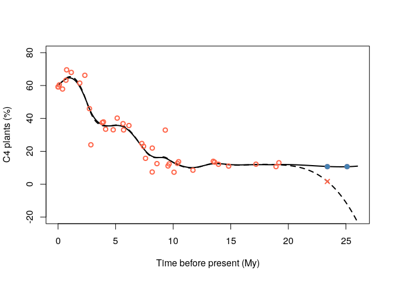
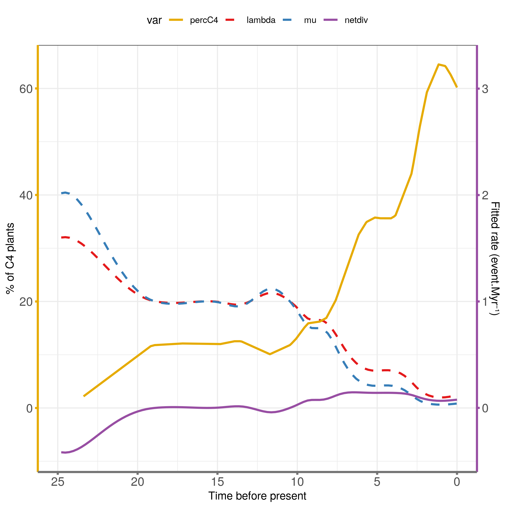

# RPANDA - C4 models

**Author**: Léo-Paul Dagallier  
**Last update**: 2023-08-09

------------------------------------------------------------------------

## Input data

Prepare the output folder:

``` bash
path_to_output="outputs/Monodoreae_3";
cd $path_to_output
mkdir RPANDA_env
```

Prepare the path variables: - in R:

``` r
path_to_tree = c("data/name_MCC_monodoreae3_monod_pruned.newick")
path_to_output = c("outputs/RPANDA_env/")
data_suffix <- "monodoreae3"
```

Read the tree:

``` r
library(ape)
library(picante)
tree <-  read.tree(file = path_to_tree)
tot_time <- max(node.age(tree)$ages)
sampling_fraction <- 88/90
```

## Package installation and load

## Environmental models: C4 fraction

Data from [Polissar *et al.*
2019](https://www.nature.com/articles/s41561-019-0399-2) and [Uno *et
al.* 2016](https://www.pnas.org/content/113/23/6355).

The subset of data used here corresponds to the sites 241, 235 and 959
from Pollisar *et al.* 2019.

### Load elevation data

``` r
Africa_C4 <-  read.table("data/AfricanC4_tropics_Polissar_et_al_2019.txt", h = T)
```

The model will not be able to fit the environmental data because the
older environmental point is at 23.38 Myr whereas the older node in the
Monodoreae phylogeny is 25.04 Myr old. In order to overcome this
problem, I just add 1 data in the environmental dataset at 25.1 Myr
which is the mean of the last more or less table dots.

Moreover, the environmental data has to specify the values at time = 0
Myr. We will assume it is the same as the most recent value.

``` r
Africa_C4_low <-  Africa_C4[39,]
Africa_C4 <-  Africa_C4[-39,]
Africa_C4 <-  rbind(c(0, Africa_C4$C4[which.min(Africa_C4$Age)]), Africa_C4, c(Africa_C4_low$Age, Africa_C4$C4[37]), c(25.1, Africa_C4$C4[37]))
```

Check that the interpolated elevation data will be correctly
interpolated (black line = predicted elevation by the spline
interpolation; red dots = known elevation):

``` r
env_data <-  Africa_C4
df <- smooth.spline(env_data[, 1], env_data[, 2])$df
spline_result <- pspline::sm.spline(env_data[, 1], env_data[, 2], df = df)

env_data_orig <- read.table("data/AfricanC4_tropics_Polissar_et_al_2019.txt", h = T)
df_orig <- smooth.spline(env_data_orig[, 1], env_data_orig[, 2])$df
spline_result_orig <- pspline::sm.spline(env_data_orig[, 1], env_data_orig[, 2], df = df)

ages <-  seq(from = 0 , to = 26, by = 0.1)
predicted_C4 <- predict(spline_result, ages)
predicted_C4_orig <- predict(spline_result_orig, ages)

{pdf(paste0(path_to_output, "Figure X - Proportion of C4 plants Polissar 2019 tropics_", data_suffix, ".pdf"))
plot(ages , predicted_C4, type = "l", lwd = 2, xlab = "Time before present (My)", ylab = "C4 plants (%)", ylim = c(-20, 80))
lines(ages , predicted_C4_orig, type = "l", lty=2, lwd = 2)
points(env_data$Age, env_data$C4, col = "tomato", pch = 1, lwd = 2)
points(Africa_C4[40,], col = "steelblue", pch = 19, lwd = 2)
points(Africa_C4[41,], col = "steelblue", pch = 19, lwd = 2)
points(Africa_C4_low, col = "tomato", pch = 4, lwd = 2)
dev.off()
}
```

    ## png 
    ##   2

``` r
{plot(ages , predicted_C4, type = "l", lwd = 2, xlab = "Time before present (My)", ylab = "C4 plants (%)", ylim = c(-20, 80))
lines(ages , predicted_C4_orig, type = "l", lty=2, lwd = 2)
points(env_data$Age, env_data$C4, col = "tomato", pch = 1, lwd = 2)
points(Africa_C4[40,], col = "steelblue", pch = 19, lwd = 2)
points(Africa_C4[41,], col = "steelblue", pch = 19, lwd = 2)
points(Africa_C4_low, col = "tomato", pch = 4, lwd = 2)
}
```

<!-- -->

#### List of models to test

λ = speciation  
µ = extinction

| λ              | µ              | Model Acronym |
|----------------|----------------|---------------|
| constant       | 0              | BConst        |
| time           | 0              | BTime         |
| constant       | constant       | BDConst       |
| time           | constant       | BTimeDConst   |
| constant       | time           | BConstDTime   |
| time           | time           | BDTime        |
| % of C4 plants | 0              | BPercC4       |
| % of C4 plants | constant       | BPercC4DConst |
| constant       | % of C4 plants | BConstDPercC4 |
| % of C4 plants | % of C4 plants | BDPercC4      |

If already run, load the results (to avoid re-running the models every
time the rmarkdown is knitted):

``` r
load(file = paste0(path_to_output, "C4_tropics2.Rdata"))
```

**Note that unfortunately, the models results objects could not be
published in this repository because the files are to big.** You would
thus need to run the models (`fit_bd` or `fit_env` functions) locally.

#### Pure Birth with constant speciation (BConst)

Fit the pure birth model (no extinction) with a constant speciation rate
with time.

``` r
source(file ="R/plot_fit_env2.R")
f.lamb <-function(t,x,y){y[1]+ 0*t}
f.mu<-function(t,x,y){0}
lamb_par<-c(0.1)
mu_par<-c()
result_BConst <- fit_env(tree,Africa_C4, tot_time,f.lamb,f.mu,lamb_par,mu_par,
                    f=sampling_fraction,expo.lamb=FALSE,fix.mu=TRUE,dt=1e-3)
result_BConst$model <- "BConst"
```

Plot the model:

``` r
plot_fit_env2(result_BConst, Africa_C4, tot_time = tot_time)
```

#### Pure Birth with variable speciation (BTime)

Fit the pure birth model (no extinction) with a exponential variation of
the speciation rate with time.

``` r
source(file ="R/plot_fit_env2.R")
f.lamb <-function(t,x,y){y[1] * exp(y[2] * t)}
f.mu<-function(t,x,y){0}
lamb_par<-c(0.1, 0.01)
mu_par<-c()
result_BTime <- fit_env(tree,Africa_C4,tot_time,f.lamb,f.mu,lamb_par,mu_par,
                    f=sampling_fraction,expo.lamb=TRUE,fix.mu=TRUE,dt=1e-3)
result_BTime$model <- "BTime"
```

Plot the model:

``` r
plot_fit_env2(result_BTime, Africa_C4, tot_time = tot_time)
```

#### Birth Death model with constant rates (BDConst)

Fit the birth-death model with constant rates.

``` r
source(file ="R/plot_fit_env2.R")
f.lamb <-function(t,x,y){y[1]+0*t}
f.mu<-function(t,x,y){y[1]+0*t}
lamb_par<-c(0.05)
mu_par<-c(0.01)
result_BDConst <- fit_env(tree,Africa_C4,tot_time,f.lamb,f.mu,lamb_par,mu_par,
                    f=sampling_fraction, cst.lamb = TRUE, cst.mu = TRUE,dt=1e-3)
result_BDConst$model <- "BDConst"
```

Plot the model:

``` r
plot_fit_env2(result_BDConst, Africa_C4, tot_time)
```

#### Birth Death model with exponential variation of the speciation (BTimeDConst)

Fit a birth-death model with exponential variation of the speciation and
constant extinction

``` r
f.lamb <-function(t,x,y){y[1] * exp(y[2] * t)}
f.mu<-function(t,x,y){y[1]+0*t}
lamb_par<-c(0.5, 0.1)
mu_par<-c(0.01)
result_BTimeDConst <- fit_env(tree,Africa_C4,tot_time,f.lamb,f.mu,lamb_par,mu_par,
                    f=sampling_fraction, expo.lamb = TRUE, cst.mu = TRUE,dt=1e-3)
result_BTimeDConst$model <- "BTimeDConst"
```

Plot the model:

``` r
plot_fit_env2(result_BTimeDConst, Africa_C4, tot_time)
```

#### Birth Death model with constant speciation and exponential variation of the extinction (BConstDTime)

Fit a birth-death model with constant speciation and exponential
variation of the extinction.

``` r
f.lamb <-function(t,x,y){y[1]+0*t}
f.mu<-function(t,x,y){y[1] * exp(y[2] * t)}
lamb_par<-c(0.01)
mu_par<-c(0.1, 0.01)
result_BConstDTime <- fit_env(tree,Africa_C4,tot_time,f.lamb,f.mu,lamb_par,mu_par,
                    f=sampling_fraction, cst.lamb = TRUE, expo.mu = TRUE,dt=1e-3)
result_BConstDTime$model <- "BConstDTime"
```

Plot the model:

``` r
plot_fit_env2(result_BConstDTime, Africa_C4, tot_time)
```

#### Birth Death model with exponential variation of both the speciation and the extinction rates (BDTime)

``` r
f.lamb <-function(t,x,y){y[1] * exp(y[2] * t)}
f.mu<-function(t,x,y){y[1] * exp(y[2] * t)}
lamb_par<-c(0.1, 0.1)
mu_par<-c(0.01, 0.01)
result_BDTime <- fit_env(tree,Africa_C4,tot_time,f.lamb,f.mu,lamb_par,mu_par,
                    f=sampling_fraction, expo.lamb = TRUE, expo.mu = TRUE,dt=1e-3)
result_BDTime$model <- "BDTime"
```

Plot the model:

``` r
plot_fit_env2(result_BDTime, Africa_C4, tot_time)
```

#### Birth Death model with speciation varying as an exponential of % of C4 plants and no extinction (BPercC4)

``` r
f.lamb <-function(t,x,y){y[1] * exp(y[2] * x)}
f.mu<-function(t,x,y){0}
lamb_par<-c(0.1, 0.01)
mu_par<-c()
result_BPercC4 <- fit_env(tree,Africa_C4,tot_time,f.lamb,f.mu,lamb_par,mu_par,
                    f=sampling_fraction, fix.mu = TRUE,dt=1e-3)
result_BPercC4$model <- "BPercC4"
```

Plot the model:

``` r
plot_fit_env2(result_BPercC4, Africa_C4, tot_time)
```

#### Birth Death model with speciation varying as an exponential of % of C4 plants and constant extinction (BpercC4DConst)

``` r
f.lamb <-function(t,x,y){y[1] * exp(y[2] * x)}
f.mu<-function(t,x,y){y[1]+0*x}
lamb_par<-c(0.1, 0.01)
mu_par<-c(0.1)
result_BPercC4DConst <- fit_env(tree,Africa_C4,tot_time,f.lamb,f.mu,lamb_par,mu_par,
                    f=sampling_fraction,dt=1e-3)
result_BPercC4DConst$model <- "BPercC4DConst"
```

Plot the model:

``` r
plot_fit_env2(result_BPercC4DConst, Africa_C4, tot_time)
```

#### Birth Death model with speciation constant and extinction varying as an exponential of % of C4 plants (BConstDPercC4)

``` r
f.lamb <-function(t,x,y){y[1] + 0*x}
f.mu<-function(t,x,y){y[1] * exp(y[2] * x)}
lamb_par<-c(0.1)
mu_par<-c(0.1, 0.001)
result_BConstDPercC4 <- fit_env(tree,Africa_C4,tot_time,f.lamb,f.mu,lamb_par,mu_par,
                    f=sampling_fraction,dt=1e-3)
result_BConstDPercC4$model <- "BConstDPercC4"
```

Plot the model:

``` r
plot_fit_env2(result_BConstDPercC4, Africa_C4, tot_time)
```

#### Birth Death model with both speciation and extinction varying as an exponential of % of C4 plants (BDPercC4)

``` r
f.lamb <-function(t,x,y){y[1] * exp(y[2] * x)}
f.mu<-function(t,x,y){y[1] * exp(y[2] * x)}
lamb_par<-c(0.1, 0.01)
mu_par<-c(0.1, 0.01)
result_BDPercC4 <- fit_env(tree,Africa_C4,tot_time,f.lamb,f.mu,lamb_par,mu_par,
                    f=sampling_fraction,dt=1e-3)
result_BDPercC4$model <- "BDPercC4"
```

Plot the model:

``` r
plot_fit_env2(result_BDPercC4, Africa_C4, tot_time)
```

#### Birth model with speciation varying as an exponential of a random variable (BRand)

``` r
f.lamb <-function(t,x,y){y[1] * exp(y[2] * x)}
f.mu<-function(t,x,y){0}
lamb_par<-c(0.1, 0.01)
mu_par<-c()
rand_var <- cbind(Age = seq(from = 0, to = 26, by = 2), Random = 1/exp(seq(from = 0, to = 26, by =2)))
result_BRand <- fit_env(tree,rand_var,tot_time,f.lamb,f.mu,lamb_par,mu_par,
                    f=sampling_fraction, fix.mu = TRUE,dt=1e-3)
result_BRand$model <- "BRand"
```

Plot the model:

``` r
plot_fit_env2(result_BRand, rand_var, tot_time)
```

#### Find the best model

``` r
models_list <- list(result_BConst, result_BTime, result_BDConst, result_BTimeDConst, result_BConstDTime, result_BDTime, result_BPercC4, result_BPercC4DConst, result_BConstDPercC4, result_BDPercC4)

AICc <- c()
model <- c()
lambda <- c()
alpha <- c()
LH <- c()
mu <- c()
beta <- c()

for (m in models_list){
  AICc = c(AICc, m$aicc)
  model = c(model, m$model)
  LH = c(LH, m$LH)
  lambda = c(lambda, m$lamb_par[1])
  if (!is.na(m$lamb_par[2])){
     alpha = c(alpha, m$lamb_par[2])
  } else{alpha = c(alpha, NA)}
    if(!is.null(m$mu_par)){
      mu = c(mu, m$mu_par[1])
      if (!is.na(m$mu_par[2])){
        beta = c(beta, m$mu_par[2])
      } else{beta = c(beta, NA)}
    } else{mu = c(mu, NA)
    beta = c(beta, NA)}
}
model_compare <- data.frame(model = model, LH = LH, AICc = AICc, Lambda = lambda, Alpha= alpha, Mu = mu, Beta = beta)
model_compare <- model_compare[order(model_compare$AICc),] # sort on AICc values
model_compare$dAICc <- model_compare$AICc - min(model_compare$AICc)
model_compare
```

The best fitting model appear to be the Birth Death model with
speciation and extinction both varying exponentially with C4 fraction.

Export the table:

``` r
write.csv(model_compare, file = paste0(path_to_output, "C4_tropics2_models_compare.csv"), quote = F)
```

#### Save the results in Rdata

``` r
rm(models_list)
rm(m)
save.image(file = paste0(path_to_output, "C4_tropics2.Rdata"))
```

#### Plot the best model:

``` r
best_model <- result_BDPercC4
tot_time <- max(node.age(tree)$ages)
t <- seq(0, tot_time, length.out = 100)

df <- smooth.spline(Africa_C4[, 1], Africa_C4[, 2])$df # define the degree of freedom for spline interpolation
spline_result <- pspline::sm.spline(Africa_C4[, 1], Africa_C4[, 2], df = df)
# plot(-spline_result$x, spline_result$ysmth, type = "l", xlab = "Time", ylab = "% of C4 plants °C")

spline_result_df <- data.frame(time = spline_result$x, percC4 = spline_result$ysmth)
BM_df = data.frame(time = t, lambda = best_model$f.lamb(t), mu = best_model$f.mu(t), netdiv = best_model$f.lamb(t) - best_model$f.mu(t))

library(tidyverse)

# spline_result_df$time <- round(spline_result_df$time, digits = 2)
# BPercC4_df$time <- round(BPercC4_df$time, digits = 2)

full_df <-  full_join(spline_result_df, BM_df)

full_df_trans <- gather(full_df, "lambda", "percC4", "mu", "netdiv", key = "var", value = "value", na.rm = T)
scale_fact = 20
full_df_trans$value[full_df_trans$var == "lambda"] <- scale_fact * full_df_trans$value[full_df_trans$var == "lambda"] 
full_df_trans$value[full_df_trans$var == "mu"] <- scale_fact * full_df_trans$value[full_df_trans$var == "mu"] 
full_df_trans$value[full_df_trans$var == "netdiv"] <- scale_fact * full_df_trans$value[full_df_trans$var == "netdiv"] 
g <- ggplot(full_df_trans)+
  geom_line(aes(x = time, y = value, group = var, color = var, linetype = var), size = 1)+
  scale_color_manual(values = c(percC4 = "#e6ab02", lambda = "#e41a1c", mu = "#377eb8", netdiv = "#984ea3"))+
  scale_linetype_manual(values = c(percC4 = "solid", lambda = "dashed", mu = "dashed", netdiv = "solid"))+
  scale_y_continuous(name="% of C4 plants", sec.axis=sec_axis(~./scale_fact, name="Fitted rate (event.Myr⁻¹)"))+
  scale_x_reverse(limits = c(25, 0), name = "Time before present")+
  theme_bw()+
  theme(axis.line.y.left = element_line(color = "#e6ab02", size = 1),
        axis.ticks.y.left = element_line(color = "#e6ab02", size = 1),
        axis.line.y.right = element_line(color = "#984ea3", size = 1),
        axis.ticks.y.right = element_line(color = "#984ea3", size = 1),
        axis.line.x = element_line(color = "#737373", size = 1),
        axis.ticks.x = element_line(color = "#737373", size = 1),
        axis.text = element_text(size = 12),
        legend.position = "top")
g
```



Save the plot:

``` r
ggsave(filename = paste0(path_to_output, "best_C4_tropics_model.png"), plot = g)
```

#### Clean the envrionment

``` r
rm(best_model)
rm(df)
rm(spline_result)
rm(spline_result_df)
rm(BM_df)
rm(full_df)
rm(full_df_trans)
```
