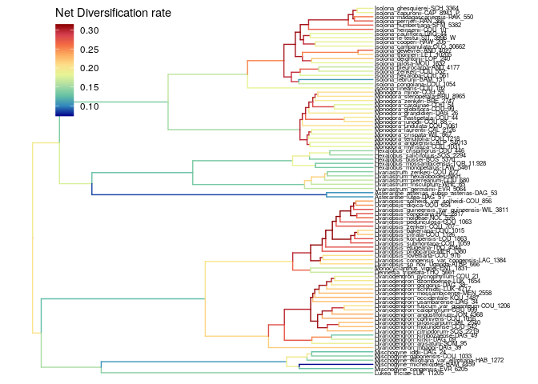

```{r setup, include=FALSE}
knitr::opts_chunk$set(echo = TRUE,
                      eval = F, warning=F, message=F,
                      fig.path  = "RevBayes_BSDR_files/")
```

# RevBayes_BSDR
**Author**: Léo-Paul Dagallier    
**Last update**: `r format(Sys.Date())`

***

**Note**: the RevBayes logs have been compressed. To reproduce this notebook, you will first need to decompress the file `output/RevBayes/monodoreae3_BDSE_RevBayes_logs.zip`.

# RevBayes
## Input data
Prepare the path variables:

- in bash:
```{bash, eval = F}
path_to_output="outputs/";
cd $path_to_output
mkdir RevBayes
cd RevBayes
```

- in R:
```{r, eval=TRUE}
path_to_tree = c("data/name_MCC_monodoreae3_monod_pruned.newick")
path_to_output = c("outputs/RevBayes/")
data_suffix = c("monodoreae3")
```

## Branch-Specific Diversification Rate Estimation
See: https://revbayes.github.io/tutorials/divrate/branch_specific.html.

### With both speciation and extinction rate shifts

Prepare several analysis:
6 vs 10 rate categories
1 rate shift, 4 rate shifts, 10 rate shifts

#### Run the analysis
```{bash, eval = F}
mpirun -np 2 rb-mpi mcmc_BDSE_6RateCat_1shift_monodoreae3.Rev
mpirun -np 2 rb-mpi mcmc_BDSE_6RateCat_4shifts_monodoreae3.Rev
mpirun -np 2 rb-mpi mcmc_BDSE_6RateCat_10shifts_monodoreae3.Rev
mpirun -np 2 rb-mpi mcmc_BDSE_10RateCat_1shift_monodoreae3.Rev
mpirun -np 2 rb-mpi mcmc_BDSE_10RateCat_4shift_monodoreae3.Rev
mpirun -np 2 rb-mpi mcmc_BDSE_10RateCat_10shift_monodoreae3.Rev

#2750
mpirun -np 2 rb-mpi mcmc_BDSE_6RateCat_4shifts_fixed_monodoreae3.Rev
mpirun -np 2 rb-mpi mcmc_BDSE_6RateCat_4shifts_free_monodoreae3.Rev
mpirun -np 2 rb-mpi mcmc_BDSE_6RateCat_4shifts_monodoreae3.Rev
```

#### Plot the results
```{r plot-prepare, echo=TRUE, warning=F, message=FALSE}
library(RevGadgets)
library(phytools)
library(tibble)
library(ggtree)
library(treeio)
library(ggplot2)
library(RColorBrewer)
source(file = "R/plot_branch_rates_tree2.R")

# load the files:
my_tree_file =  path_to_tree
my_branch_rates_file = paste0(path_to_output, data_suffix, "_BDSE_6RateCat_1shift_rates.log")
my_branch_rates_files = list.files(path_to_output)[grep("rates.log", list.files(path_to_output))]

# set the colors:
Colors <- colorRampPalette(rev(c('darkred',brewer.pal(n = 8, name = "Spectral"),'darkblue')))(100)
```

Branch-specific **speciation** rates:

```{r plot-speciation, echo=TRUE, warning=F}
plot_branch_rates_tree2(tree_file=my_tree_file,  branch_rates_file=my_branch_rates_file, parameter_name = "lambda", trans = "identity", colors = Colors) + geom_tiplab(color = "black", size = 2) + scale_color_gradientn("Speciation rate", colors = Colors, trans = "identity") + theme(legend.position=c(0.2,0.85))+ scale_x_continuous(limits = c(0,35))
ggsave(paste0(path_to_output, "RevBayes_", data_suffix, "_BDSE_6RateCat_Speciation_rate.pdf"), width=15, height=15, units="cm")
```


For all the analyses:
```{r plot-speciation-all, echo=TRUE, warning=F, eval=F}
for (f in my_branch_rates_files){
  plot_branch_rates_tree2(tree_file=my_tree_file,  branch_rates_file=paste0(path_to_output, f), parameter_name = "lambda", trans = "identity", colors = Colors) + geom_tiplab(color = "black", size = 2) + scale_color_gradientn("Speciation rate", colors = Colors, trans = "identity") + theme(legend.position=c(0.2,0.85))+ scale_x_continuous(limits = c(0,35))
ggsave(paste0(path_to_output, "RevBayes_BSDR_Speciation_rate_", gsub(x = f, pattern = ".log", replacement = ""), ".pdf"), width=15, height=15, units="cm")
}
```

Branch-specific **extinction** rates:
```{r plot-extinction, echo=TRUE, warning=F}
plot_branch_rates_tree2(tree_file=my_tree_file,  branch_rates_file=my_branch_rates_file, parameter_name = "mu", trans = "identity", colors = Colors) + geom_tiplab(color = "black", size = 2) + scale_color_gradientn("Extinction rate", colors = Colors, trans = "identity") + theme(legend.position=c(0.2,0.85))+ scale_x_continuous(limits = c(0,35))
ggsave(paste0(path_to_output, "RevBayes_", data_suffix, "_BDSE_6RateCat_Extinction_rate.pdf"), width=15, height=15, units="cm")
```


For all the analyses:
```{r plot-extinction-all, echo=TRUE, warning=F, eval=F}
for (f in my_branch_rates_files){
  plot_branch_rates_tree2(tree_file=my_tree_file,  branch_rates_file=paste0(path_to_output,f), parameter_name = "mu", trans = "identity", colors = Colors) + geom_tiplab(color = "black", size = 2) + scale_color_gradientn("Extinction rate", colors = Colors, trans = "identity") + theme(legend.position=c(0.2,0.85))+ scale_x_continuous(limits = c(0,35))
ggsave(paste0(path_to_output, "RevBayes_BSDR_Extinction_rate_", gsub(x = f, pattern = ".log", replacement = ""), ".pdf"), width=15, height=15, units="cm")
}
```

Branch-specific **net diversification** rates:
```{r plot-netdiv, echo=TRUE, warning=F}
plot_branch_rates_tree2(tree_file=my_tree_file,  branch_rates_file=my_branch_rates_file, parameter_name = "net_div", trans = "identity", colors = Colors) + geom_tiplab(color = "black", size = 2) + scale_color_gradientn("Net Diversification rate", colors = Colors, trans = "identity") + theme(legend.position=c(0.2,0.85))+ scale_x_continuous(limits = c(0,35))
ggsave(paste0(path_to_output, "RevBayes_", data_suffix, "_BDSE_6RateCat_Net_Diversification_rate.pdf"), width=15, height=15, units="cm")
```


For all the analyses:
```{r plot-netdiv-all, echo=TRUE, warning=F, eval=F}
for (f in my_branch_rates_files){
  plot_branch_rates_tree2(tree_file=my_tree_file,  branch_rates_file=paste0(path_to_output,f), parameter_name = "net_div", trans = "identity", colors = Colors) + geom_tiplab(color = "black", size = 2) + scale_color_gradientn("Net diversification rate", colors = Colors, trans = "identity") + theme(legend.position=c(0.2,0.85))+ scale_x_continuous(limits = c(0,35))
ggsave(paste0(path_to_output, "RevBayes_BSDR_Net_Diversification_rate_", gsub(x = f, pattern = ".log", replacement = ""), ".pdf"), width=15, height=15, units="cm")
}
```

